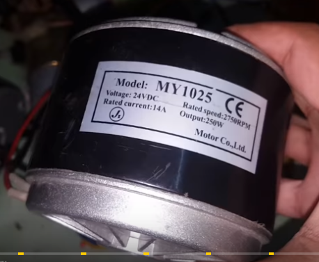
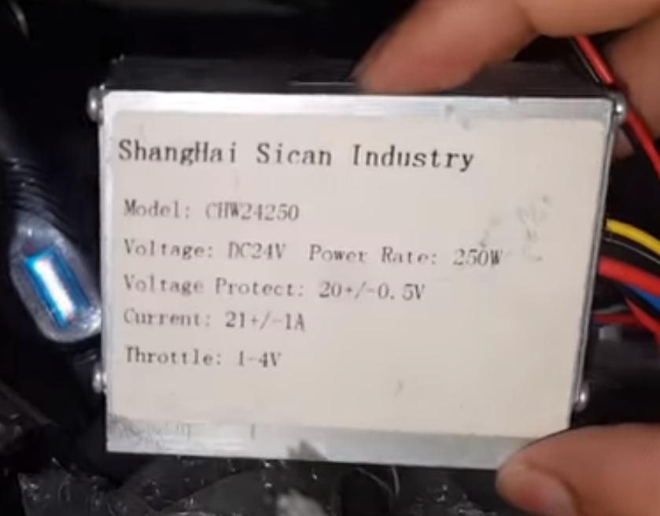
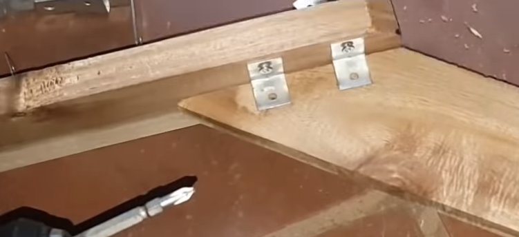
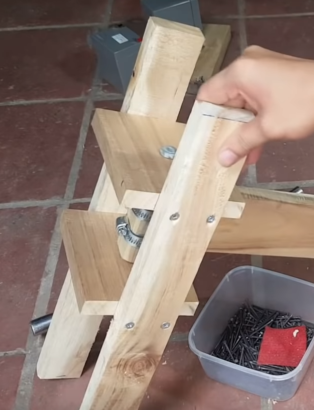
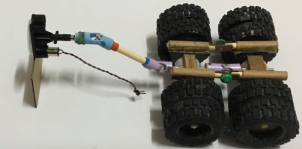
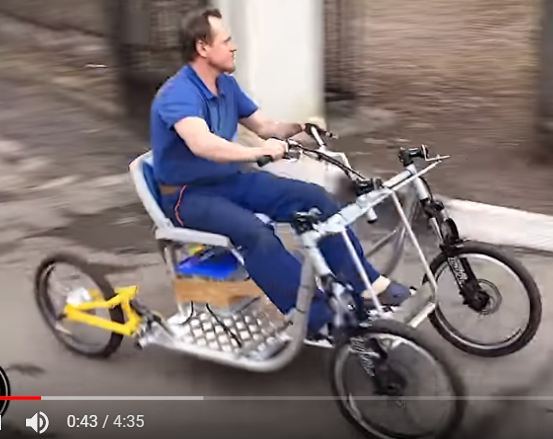
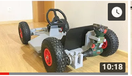

390


### TT马达轮 

轮胎外径66mm,内51.8mm,宽26.6mm,内框轴外径直13.8,轴孔宽3.66mm,轴孔长5.3mm 


370减速电机 16￥


采购清单   25mm 水管


```
电动小车 三轮 成人可坐
```






https://www.youtube.com/watch?v=B53TV-3KDEM




https://www.youtube.com/watch?v=6iOlYR-4H5w


https://www.youtube.com/watch?v=hwHUhzISjLE



https://www.youtube.com/watch?v=wRAZlIKp-gw


https://www.youtube.com/watch?v=Lb17YiUi43A&t=157s




https://www.youtube.com/watch?v=EQyVGVwZnzo


facebook python 人工智能库

PyTorch