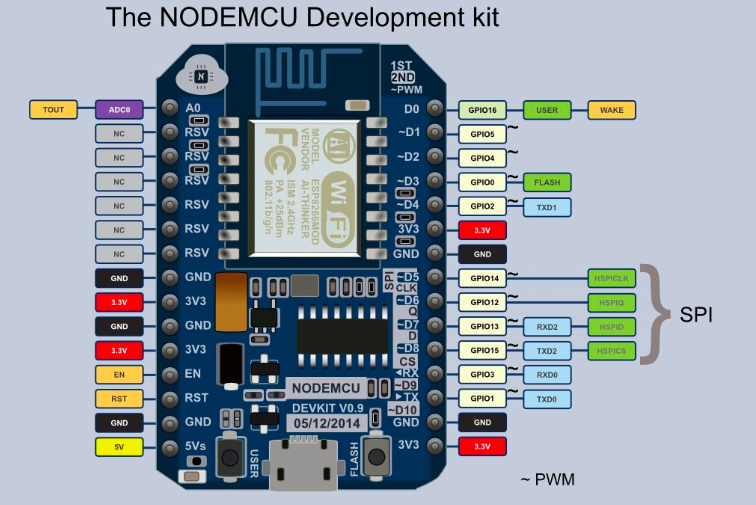
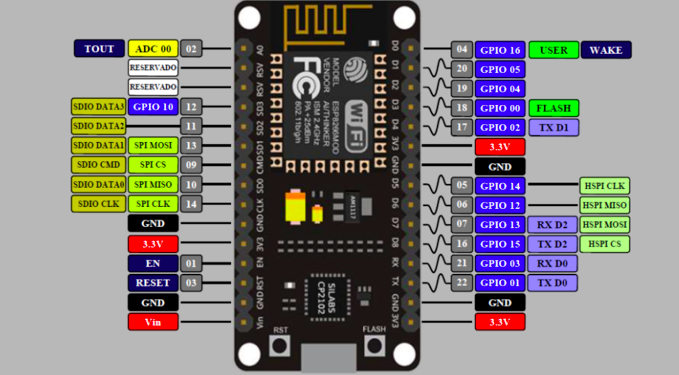

# 20180714

doc https://dfrobot.gitbooks.io/upycraft_cn/content/






now


> 人体传感器 HC-SR501

+ 针脚 左侧的针脚是正极，右侧针脚是负极，中间针脚是信号针

  + 球正面看

  + **左 时间 顺时针 增加时间 2、调节延时电位器顺时针旋转，感应延时加长（约300S），反之，感应延时减短（约 0.5S）**  

  + **右 距离 顺时针 增加距离  1、调节距离电位器顺时针旋转，感应距离增大（约 7 米），反之，感应距离减小（约 3 米）。**

    

  ```
  
  # This file is executed on every boot (including wake-boot from deepsleep)
  
  #import esp
  
  #esp.osdebug(None)
  
  import gc
  
  import os
  
  #import webrepl
  
  #webrepl.start()
  
  #gc.collect()
  
  from simple import MQTTClient
  from machine import Pin
  import network
  import time
  
  def fabu():
      c =MQTTClient("umqtt_client", server="192.168.0.107",port=61613,user="admin",password="password")
      #c.set_callback("test")
      
      c.connect()
      c.publish("test", "ip")
      #c.subscribe("test")
      c.disconnect()
      
  
  
  
  
  def sub_cb(topic, msg):
      global state
      print((topic, msg))
      '''
      if msg == b"on":
          Pin(2,Pin.OUT).value(0) #亮
          state = 1
      elif msg == b"off":
          Pin(2,Pin.OUT).value(1) #灭
          state = 0
      elif msg == b"toggle":
          # LED is inversed, so setting it to current state
          # value will make it toggle
          #Pin(2,Pin.OUT).vaue(0) #亮
          state = 1 - state
      '''
          
    
  
  def dingyue(server="localhost"):
      c =MQTTClient("umqtt_client", server="192.168.0.107",port=61613,user="admin",password="password")
      c.set_callback(sub_cb)
      c.connect()
      c.subscribe("test")
      while True:
          if True:
              # Blocking wait for message
              c.wait_msg()
          else:
              # Non-blocking wait for message
              c.check_msg()
              # Then need to sleep to avoid 100% CPU usage (in a real
              # app other useful actions would be performed instead)
              time.sleep(1)
  
      c.disconect()
  
  def connectWifi():
    sta_if = network.WLAN(network.STA_IF)
    sta_if.active(True)
    #sta_if.scan()                             #  扫描当前可连接的WiFi名称
    sta_if.connect("tianwanggaidihu", "dabingjiayiqie")               # 设置要连接WiFi的名称和连接密码
    return sta_if
    #status = sta_if.isconnected()                      # 检查是否连接成功
    print(status)
  
  def ledTrue(num):
    for i in range(num):
      led=Pin(2,Pin.OUT)
      led.value(0)              #turn off
      time.sleep(0.5)
      led.value(1)              #turn on
      time.sleep(0.5)
  
  
  def mainFun():
      wifi = connectWifi()
      time.sleep(3)
      while True:
        status = wifi.isconnected()
        if status:  #连接wifi成功
          ledTrue(3)
          break
        else:
          wifi.connect("tianwanggaidihu", "dabingjiayiqie")
        
        time.sleep(1) 
      
      
  def renTiFun():
    led=Pin(5,Pin.IN)
    led2=Pin(2,Pin.OUT)
    while True:
      time.sleep(0.3)
      status = led.value()
      if status == 1:
        led2.value(0)
      else:
        led2.value(1)
      print(led.value())
    
  
  if __name__ == "__main__":
      #mainFun()
      connectWifi()
      renTiFun()
  
  
  
  
  
  
  ```

  


> 配置 热点  连接wifi

```
import network

#配置AP
#ap_if = network.WLAN(network.AP_IF)
#ap_if.config(essid="tianwanggaidihu", authmode=network.AUTH_WPA_WPA2_PSK, password="dabingjiayiqie")
#print(ap_if)

#连接wifi
import network
sta_if = network.WLAN(network.STA_IF)
sta_if.active(True)
sta_if.scan()                             #  扫描当前可连接的WiFi名称
sta_if.connect("tianwanggaidihu", "dabingjiayiqie")               # 设置要连接WiFi的名称和连接密码
sta_if.isconnected()                      # 检查是否连接成功

```

```
连接wifi


#hardware platform: FireBeetle-ESP8266

import time
from machine import Pin
#led=Pin(2,Pin.OUT)          #create LED object from pin2,Set Pin2 to output

#while True:
  #led.value(1)              #turn off
  #time.sleep(0.5)
  #led.value(0)              #turn on
  #time.sleep(0.5)
import network

#配置AP
#ap_if = network.WLAN(network.AP_IF)
#ap_if.config(essid="tianwanggaidihu", authmode=network.AUTH_WPA_WPA2_PSK, password="dabingjiayiqie")
#print(ap_if)

#连接wifi
import network
sta_if = network.WLAN(network.STA_IF)
sta_if.active(True)
sta_if.scan()                             #  扫描当前可连接的WiFi名称
sta_if.connect("tianwanggaidihu", "dabingjiayiqie")               # 设置要连接WiFi的名称和连接密码
status = sta_if.isconnected()                      # 检查是否连接成功
print(status)
if status:
  ledTrue(10)


def ledTrue(num):
  for i in range(num):
    led=Pin(2,Pin.OUT)
    led.value(1)              #turn off
    time.sleep(0.5)
    led.value(0)              #turn on
    time.sleep(0.5)

```

> mqtt  

+ mcropython umqtt 

  + 官网 https://pypi.org/project/micropython-umqtt.simple/1.3/

  + github 地址 https://github.com/micropython/micropython-lib/tree/master/umqtt.simple

  + Pi  mqtt 服务器 地址 http://192.168.0.107:61680/console/index.html

  + 用户名 admin 密码password

  + > Mqtt

    ```
    启动 mqtt
    sudo ~/tools/apollo/apache-apollo-1.7.1/bin/dabai/bin/apollo-
    
        _____                .__  .__
       /  _  \ ______   ____ |  | |  |   ____
      /  /_\  \\____ \ /  _ \|  | |  |  /  _ \
     /    |    \  |_> >  <_> )  |_|  |_(  <_> )
     \____|__  /   __/ \____/|____/____/\____/
             \/|__|  Apache Apollo (1.7.1)
    
    
    Loading configuration file '/home/pi/tools/apollo/apache-apollo-1.7.1/bin/dabai/etc/apollo.xml'.
    INFO  | OS     : Linux 4.1.13-v7+ (Raspbian GNU/Linux 8.0 (jessie))
    INFO  | JVM    : Java HotSpot(TM) Server VM 1.8.0 (Oracle Corporation)
    INFO  | Apollo : 1.7.1 (at: /home/pi/tools/apollo/apache-apollo-1.7.1)
    INFO  | OS is restricting the open file limit to: 100000
    INFO  | Starting store: leveldb store at /home/pi/tools/apollo/apache-apollo-1.7.1/bin/dabai/data
    WARN  | Using the pure java LevelDB implementation which is still experimental.  If the JNI version is not available for your platform, please switch to the BDB store instead. http://activemq.apache.org/apollo/documentation/user-manual.html#BDB_Store
    INFO  | virtual host startup is waiting on store startup
    INFO  | Accepting connections at: tcp://0.0.0.0:61613
    INFO  | Accepting connections at: tls://0.0.0.0:61614
    INFO  | Accepting connections at: ws://0.0.0.0:61623/
    INFO  | Accepting connections at: wss://0.0.0.0:61624/
    INFO  | broker startup is waiting on start virtual-host: dabai, start connector: wss, start jetty webserver
    INFO  | virtual host startup is no longer waiting.  It waited a total of 11 seconds.
    INFO  | broker startup is now waiting on start jetty webserver
    INFO  | Administration interface available at: http://0.0.0.0:61680/
    INFO  | Administration interface available at: https://0.0.0.0:61681/
    INFO  | broker startup is no longer waiting.  It waited a total of 16 seconds.
    ```

    ```
    pi mqtt 测试
    订阅
    mosquitto_sub -u admin --pw password  -t test -h 192.168.0.109 -p 61613
    发布
    mosquitto_pub -u admin --pw password  -t test -h 192.168.0.109 -p 61613 -m 'hi'
    ```

    ```
    
    #mqtt 发布 订阅代码 收到消息板载亮灯
    from lib.simple import MQTTClient
    from machine import Pin
    
    # Test reception e.g. with:
    # mosquitto_sub -t foo_topic
    
    
          
    
    def fabu():
        c =MQTTClient("umqtt_client", server="192.168.0.107",port=61613,user="admin",password="password")
        #c.set_callback("test")
        
        c.connect()
        c.publish("test", "ip")
        #c.subscribe("test")
        c.disconnect()
        
    
    
    
    
    def sub_cb(topic, msg):
        global state
        print((topic, msg))
        if msg == b"on":
            Pin(2,Pin.OUT).value(0) #亮
            state = 1
        elif msg == b"off":
            Pin(2,Pin.OUT).value(1) #灭
            state = 0
        elif msg == b"toggle":
            # LED is inversed, so setting it to current state
            # value will make it toggle
            #Pin(2,Pin.OUT).vaue(0) #亮
            state = 1 - state
            
      
    
    def dingyue(server="localhost"):
        c =MQTTClient("umqtt_client", server="192.168.0.107",port=61613,user="admin",password="password")
        c.set_callback(sub_cb)
        c.connect()
        c.subscribe("test")
        while True:
            if True:
                # Blocking wait for message
                c.wait_msg()
            else:
                # Non-blocking wait for message
                c.check_msg()
                # Then need to sleep to avoid 100% CPU usage (in a real
                # app other useful actions would be performed instead)
                time.sleep(1)
    
        c.disconnect()
    
    
    if __name__ == "__main__":
        
        #fabu()
        dingyue()
        pass
    
    ```

    > mqtt python

    ```
    sudo easy_install paho-mqtt
    Searching for paho-mqtt
    Best match: paho-mqtt 1.3.1
    Adding paho-mqtt 1.3.1 to easy-install.pth file
    
    Using /usr/local/lib/python2.7/dist-packages
    Processing dependencies for paho-mqtt
    Finished processing dependencies for paho-mqtt
    
    
    ```

    


> uPyCraft

```

# This file is executed on every boot (including wake-boot from deepsleep)

#import esp

#esp.osdebug(None)

import gc

import os

#import webrepl

#webrepl.start()

gc.collect()


# --- me ---
import time
from machine import Pin
led = Pin(2,Pin.OUT)
while True:
  time.sleep(1)
  led.value(1)
  time.sleep(1)
  led.value(0)

```

> oled 

+ i2c 接口 

  ```
  左2 GPIO5 	SDA
  左3 GPIO4	SCL
  vcc	5v 3.3v
  gnd
  ```

+ ssd1306   显示器

  ```
  #hardware platform: FireBeetle-ESP8266
  from machine import Pin,I2C
  import ssd1306
  
  i2c = I2C(scl=Pin(5), sda=Pin(4), freq=100000)  #Init i2c
  
  lcd=ssd1306.SSD1306_I2C(128,64,i2c)             #create LCD object,Specify col and row
  lcd.text("DFRobot",0,0)                         #set "DFRobot" at (0,0)
  lcd.text("chengdu",24,16)                       #set "chengdu" at (24,16)
  lcd.text("123456",64,24)                        #set "123456" at (64,24)
  lcd.show()                                      #display
  ```

  


> 点亮led

```
from  machine import Pin
led = Pin(5,Pin.OUT)  #gpio 左2 D1
led.value(1) 亮
led.value(0) 灭
```

```
	板载led 蓝灯
	led=Pin(2,Pin.OUT)
    led.value(0)              亮
    time.sleep(0.5)
    led.value(1)              #灭
    time.sleep(0.5)
```

