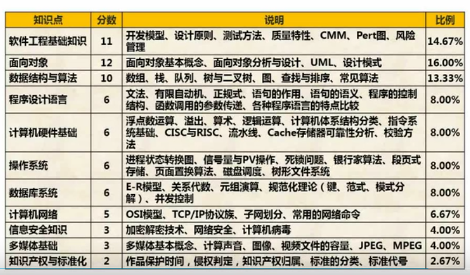

软件设计

任务： 需求分析 、设计模型，给出问题解决方案

工程管理：概要设计  、 详细设计

结构化分析方法

概要设计： 体系结构设计、数据设计、接口设计

详细设计：数据结构、算法设计

面向对象分析方法

概要设计：体系结构、初步类、数据、结构设计

详细设计：构建设计


下午1、数据流2、数据库3、UML数据库4、算法5、java




```
6分  计算机体系结构
```

进制转换 

任意进制 转 10进制


任意进制转 2进制


2进制  转 8  16进制

2进制对 8进制   1对3  二的三次方，从右三位分段，取值为1 的  2的几次方从0开始

2转16  1对4  二的四次方 从右分4段 取1的2的几次方

 1-9 A10 B11 C12 D13 E14 F15 G16


原码  反码 补码 移码 

原码 8位 默认补0 第一位符号为  为1是负数  原码相加1 + -1  二进制相加 结果为-2   10000010 -2

原码不能直接运算 

反码  正数一样   负数 第一个符号位为1 剩下  按位取反 1111 1110 表示-1    1+ -1    二进制计算为负数  则结果为1111 1111 表示-0

补码 整数一样， 负数是反码的基础上加以 0000 0001 补码是 1111 1110 + 1 就是 1111 1111  1+ -1 就是 0 正确

移码用作浮点运算的阶码 移码是补码的基础上 符号位 取反 整数1 为 0000 0001  移码为 1000 0001 负数0111 1111    相加 为1000 0000   1是负数

反码是原码的颠倒， 补码是反码 加一  ，  移码是补码符号位取反  

原码  反码 补码 整数都一样  移码100表示整数一样， 就是第一位为0 ， 反码和补码一样 符号位取反

原码反码补码表示范围 ： 一个字节8个位的原码取值范围是多少十进制


> 软件工程

自低向上 质量、过程、方法 、工具


> 软件开发模型   软件模型


计划 分析 设计 编码 测试 运维

用户不知道需要什么样的  业务层面 

**瀑布模型**：  需求明确 二次开发， 需求难以把握 结构化代表

**原型**： 定义需求模型不明确 原型页面，需求分析阶段 快速构建 澄清问题

**演化**：从原型 到最终产品

**螺旋**：将瀑布 月快速原型结合加入风险分析  减少风险 复杂大型软件

**增量**：核心部分 用户使用  一部分 先做一块再做一块，优势 1、软件快速交付2、早起增量加强后续开发理解3、优先级高的首先交付

**v模型**：瀑布模型 一样  各阶段都有测试阶段 提早发现问题

**喷泉**： 面向对象 其他是结构化 迭代 无间隙	

**快速开发**RAD：瀑布和CBSD组装 可是化开发VB 快速构建

​	业务、数据、过程、应用、测试交付建模？可视化构建

构建组装CBSD：标准构建 组装 思路 提高软件复用性 减小成					本 提高 可靠性 构建库标准COM/DCOM/COM+EJB

**敏捷开发**：不强调文档 一组模型  自适应、水晶、特征驱动、SCRUM、极限编程  价值观、原则、最佳实践

目标：尽可能早的持续的对有价值的软件进行交付

水晶法：不同项目不同的策略方法

极限编程xp：沟通、简单、反馈、勇气

并列争球阀：迭代30天冲刺

自适应软件开发ASD：构建复杂软件和系统的技术，人员写作，自我组织

​	原则 简单 先实现做了这么多不一定用得上

​		反馈 用户反馈

​		勇气 面对变更

​	少会、站会、小型发布、砍文档、用户参与 局限性 中小型项目 不适用大项目

开发不耗时   调试耗时


> 系统开发方法

**结构化开发方法**：  分析 、设计、程序设计 组成

自顶向下，适合大型数据处理系统，解决数据处理领域问题

​		思想，复杂分解 自顶向下 逐层分解

​		分析：（需求分析 做什么  数据流图）

​		设计：概要设计 和详细设计

​		概要设计 软件结构 数据结构 模块层次 调用关系  人机界面

​		详细设计 实现算法 局部结构

​		程序设计：信息隐藏 模块独立

​		信息隐藏  信息不显示 无权访问

​		模块独立 耦合 模块之间联系紧密程度

​		内聚  内部元素之间联系紧密程度

​		高内聚 低耦合

​		内聚：功能内聚，协同缺一不可；顺序内聚，顺序执行；通信，一个区域；过程，特定次序；瞬时，统一时间间隔内执行；逻辑，逻辑上相关；偶然，没有关系；

​		耦合：非直接，不依赖；数据，参数传递；标记，接口传递；控制，传递信息包含内部逻辑；外部，软件意外；公共，全局；内容，访问内部，代码重叠，多个入口；

**原型**： 需求分析阶段 需求不明确

**面向对象**开发法：

​	对象及属性

​	类属及成员

​	整体及部分

代表 UML方法

OOA面向对象分析 

OOD面向对象设计：单一职责、开放封闭、李氏，子类替换父类、依赖倒置，依赖抽象不是实现，针对接口不针对实现、接口隔离，使用多个接口比一个接口好、组合重用，使用组合减少继承、迪米特，对象少了解

OOP系统功能编码


> 软件测试与维护

软件测试目的尽可能多的缺陷

原则

1、早 2、测自己3、合理不合理，有效无效数据4、改后回归5、尚未发现数量与已发现数据成正比

**测试阶段** 单元、集成、确认、系统

1、单元测试： 编程阶段 自测 详细设计中的错误 在该阶段制定。

2、集成测试：模块组装程序测试，模块接口与通信问题，模块间数据丢失，有害影响，子功能组合主功能，个别误差，全程数据结构。  发现设计阶段产生的错误 在设计阶段制定。

集成：非渐增式  渐曾式

非渐增式：所有模块集成测试，整体测试。无法分清真正错误，引起的假性错误，定位困难，适合小软件

渐增式：单元和集成合并一起，逐渐加1，容易定位，改正错误

3、确认测试：需求说明书，与用户一致，在需求分析阶段制定。 

配置复查，保证文档 与 程序一致。验收测试，确认需求满足

软件产品，开发商a测试客户在开发现场，开发记录，受控测试，b测试用户现场开发不在，用户记录，非受控，交付使用。

4、系统测试：对完整、集成系统测试，实现真实系统环境，确定开发合同要求，依赖用户需求和开发合同。

测试功能⭐️、健壮性、性能⭐️、界面、安全性、安装范安装。

功能测试，黑盒测试

性能测试，相应时间、吞吐量、并发用户数、资源利用率

为非功能性需求

**白盒测试**  测程序结构运作  黑盒测功能，运用在 单元、集成、系统测试流程

语句、判定、条件、判定组合、多条件、路径覆盖

语句覆盖： 每条语句执行一次

判定覆盖：语句稍强每个判定 真假 分支覆盖

条件覆盖： 每个判定的多条件值满足一次

多条件覆盖：条件组合值， 一定满足 判定、条件、条件组合覆盖

路径覆盖：最全面的覆盖，每一条可能执行的路径

**McCabe复杂度**： 白盒测试技术：包括环路、基本、模块设计、设计、集成复杂度

环路复杂度：

度量 讲流程图 转 有向图即控制流图

环路复杂度

V(G) = m-n+2    环路个数 = 有向弧数-节点数+2

弧数是 线段数 交叉分割 直线段数

软件复杂性：总代码行数，书写错误和语法错误

**黑盒测试**：功能测试 ，程序接口测试 需求给个说明书 ，软件界面 功能，测试方法包括： 等价划分、边值分析、错误推测、因果图

1、等价类划分： 符合需求说明书 为有效等价类；不符合无效等价类，检验容错性；为每一个无效等价类设计测试用例

2、边值分析：每一个等价类边界  与等价划分相结合

3、错误推测：经验直觉

4、因果图：

容错系统：冗余附加技术包括1、备份程序存储调用2、错误检测和恢复3、实现容错固化程序

**软件维护**：需求硬件变化的软件修改，修改记录，新旧不同之处。维护类型，改正，适应，完善，预防

改正性维护：开发阶段已发生，测试阶段为发生错误，制定计划进行修改，复查和控制

适应性维护：适应技术变化，管理需求的修改，改善硬件环境

完善性维护：扩充功能，改善性能的修改，占维护工作比重最大

预防性维护：改进可靠性、维护性，硬件 带宽

软件可维护性—理解、改正、改动、改进的难易程度

Boehm质量模型：可理解性、可测试性、可修改性

机构化设计的主要原则：模块化、信息隐蔽、高内聚、低耦合

> 
>
> 软件质量特性标准

ISO/IEC 9126 和 Mc Call 软件质量模型

IOS/IEC 9126模型 ：质量属性类中不属于之一类的

软件质量：功能、可靠、易用、效率、维护、可移植

功能：适合、准确、互操作、安全保密性

可靠：成熟、容错、易恢复

易用：易理解、易学、易操作、吸引

效率：时间、资源利用

维护：易分析、易改变、稳定、测试

可移植：适应、易安装、共存、易替换


维护性

易分析、改变、稳定、测试

测试性：确认修改 软件所需努力有关的

易分析：诊断缺陷或失效原因待修改

易改变：修改排错 涉及环境变换

稳定性： 修改成为预料效果

文档：

1、通过文档沟通

2、提高开发效率

3、不可或缺


正式技术评审：

1、发现功能逻辑错误

2、证实满足需求

3、符合预定义标准

4、一致的开发软件

4、项目更易管理


McCall： 软件运行 修改 转移

运行： 正确、可靠、完整、使用  效率

修改： 维护、灵活、测试

转移： 移植、复用、共运行性

**软件技术评审**：

**能力成熟度模型集成（CMMI）**：模型间不一致和重复

两种表示方法：阶段表示法  、连续式表示法

阶段表示法：五个成熟度等级

初始级：软件无序依赖个人努力

可重复级（二级） 基本的项目管理，对成本进度功能跟踪，类似项目可重复

已定义级（三级）管理和工程 文档化、标准化，标准软件过程

已管理级（四级）软件过程和产品质量有度量标准，得到控制

优化级（五级）对新技术概念，定量分析持续促进改进

质量评审：规格说明书符合用户需求，可测试性，可靠性

软件质量评审： 模块结构 评审内容 1、数据流结构2、控制流结构3、模块结构与功能结构

模块评审：

1、控制流结构：处理模块与模块之间的流程关系

2、数据流结构：数据模块被处理模块架构的流程

3、模块结构与功能结构关系：功能与数据流对应关系，功能，输入，输出数据

统一过程：分派任务和责任的纪律化方法，用例驱动，体系结构为核心，迭代增量的软件过程架构，UML方法支持

RUP四阶段：

1、构思阶段：沟通和计划活动 定义 细节

2、细化阶段：沟通和建模 分析 设计模型  类 体系结构

3、构建阶段：设计转实现，集成测试

4、移交阶段：用户测试 意见 迭代

RUP5个核心：工作、需求、分析、设计、实现、测试


> 
>
> 软件项目管理

**项目管理九大知识领域**：范围、时间、成本、质量，人力、沟通、风险、采购、整体管理

整体管理：生命周期管理、全局性管理、综合性管理

范围管理：包括什么不包括什么工作

时间管理：进度管理，按时完成

成本管理：预算范围内

质量管理：方针、目标、职责，在计划、控制、保证

人力资源管理：

沟通管理：计划、编制、信息分发、绩效报告、项目干系人

风险管理：风险影响项目成功之前消除源头

采购管理：

**网络计划技术**： 大型项目进度计划，

关键路径 AOE

**甘特图**：水平线段表示任务的工作阶段

已完成任务纵线扫过，未完成任务纵线未扫过

缺点无法表示 任务间存在的复杂逻辑关系

1、清晰的开始结束持续时间

2、清晰表单任务并行关系

3、不能清晰确定任务依赖关系

**PERT**图：有向图，不能清晰描述各任务之间的并行情况

**风险管理**：损失或伤害的可能性。包含不确定性、针对未来、会带来损失

风险识别：项目、技术、商业风险三种

风险评估：风险参照水准，成本、进度、性能

风险控制： 

关心未来、变化、选择

风险曝光度是    错误概率 * 损失

风险优先级：根据风险暴露（风险曝光度）

已知沟通成员 ，求沟通路径 n*(n-1)/2

精华阶段：分析问题领域，健全体系结构，编制计划，需求分析，架构演进


人员管理：人员工作能力、知识背景、工作风格、性却爱好


软件配置管理：SCM 标识、控制、确保变更正确，包括版本管理、配置支持、变更支持、过程支持、团队支持、变化报告、审计支持


