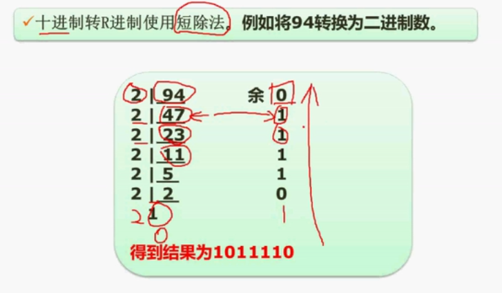

下午1、数据流2、数据库3、UML数据库4、算法5、java


软件设计

任务： 需求分析 、设计模型，给出问题解决方案

工程管理：概要设计  、 详细设计

结构化分析方法

需求分析：数据流图、实体联系图、状态迁移图、数据字典

概要设计： 体系结构设计、数据设计、接口设计

详细设计：数据结构、算法设计

面向对象分析方法

概要设计：体系结构、初步类、数据、结构设计

详细设计：构建设计


> 
>
> 面向对象
>
> 

代码

class   abstract  extends超类  interface implements

public 公有   protected保护定义   private 私有

import 导包

类修饰符  public abstract  final  private

class 关键字

extends 继承关键字  implements 接口关键字

警惕 public  类名 变量

```
接口
interface aaa{}

class bbb implements aaa{
	public void ccc(double x1, doubley1){
        
	}
}
类定义
class aaa{
    
}
class fff （）{
    
}

abstract class ccc{   抽象类
        abstract public void ddd()
}

class  eee extends ccc{
    e继承了c
}


```

java


适配器：

生成器模式：

生成器：

桥接模式：

策略模式：


abstract void doPaint(Matrix m)


> 第2章 基础

加密算法 公开 ecc dsa rsa

对称加密 des

累存器： 数据 控制信息 工作状态   编码 对应 指令长度

程序计数器：指令地址

程序状态寄存器：标志信息分为   进位、零、符号、溢出、奇偶标志位

地址寄存器：计数器、堆栈、变址、段  记录内存地址

累加寄存器：数据寄存器

协调存储器和外设三地址总线：数据总线、控制总线、地址总线

总线结构：cpu总线、内存总线、io总线

cpu 运算器： 1、算数逻辑2、累加 加法 3、数据缓冲 4、状态条件

cpu 控制器 ：1、计数器 2、指令寄存3、指令译码 4、时序

38000H    4 * 8 * 3   32 *3 

RISC 精简指令 CISC 复杂指令

RISC特点

1、频率高

2、长度固定、格式寻址少

3、只存取访问主存

4、流水线

5、cpu增加通用寄存器数量

6、硬件控制

7、优化编译

flynn分类法4中计算类型平台：

sisd单指令单数据流

misd			无实例

simd

mimd ？？

蠕虫病毒： 熊猫烧香、红色代码、爱虫病毒

冰河：木马

cache地址映射：

全相联：块冲突少、利用率高 ；目录大、成本高、查表慢

直相联：主存只映射到cache一部分 特点硬件简单、不需要相联存储器、访问速度快；冲突率高，cache利用率低

组相联：折中，组件映射，组内全相联  有较低的冲突率、较高的块利用率，较快速度，和较低的成本

cpu中断响应时间： 发出中断请求 到 开始进入中断处理

总线带宽：总线宽度32b/8   4B * 200Mhz/5个时钟            每个时钟传送40M

指令流水线： 指标3个

1、吞吐率：

2、加速被

3、效率： 


> 第3章 操作系统
>
> 

字节编址  虚拟页式存储 

页面变换表 页号 状态   16位/8  2B 2字节

地址块索引 索引文件  一个物理块存储n个地址

索引节点中8个地址块  2个一级  1个 二级       剩余5个直接索引

编号5逻辑块 实际物理第6块  采用一级索引    

块大小4B  4字节   索引块大小 1kb  就是   256个索引    ？？？？？？ 2012年下半年28题

时间片轮转法  ：


```
6分  计算机体系结构
```

进制转换 

任意进制 转 10进制


任意进制转 2进制




2进制  转 8  16进制

2进制对 8进制   1对3  二的三次方，从右三位分段，取值为1 的  2的几次方从0开始

2转16  1对4  二的四次方 从右分4段 取1的2的几次方

 1-9 A10 B11 C12 D13 E14 F15 G16


原码  反码 补码 移码 

原码 8位 默认补0 第一位符号为  为1是负数  原码相加1 + -1  二进制相加 结果为-2   10000010 -2

原码不能直接运算 

反码  正数一样   负数 第一个符号位为1 剩下  按位取反 1111 1110 表示-1    1+ -1    二进制计算为负数  则结果为1111 1111 表示-0

补码 整数一样， 负数是反码的基础上加以 0000 0001 补码是 1111 1110 + 1 就是 1111 1111  1+ -1 就是 0 正确

移码用作浮点运算的阶码 移码是补码的基础上 符号位 取反 整数1 为 0000 0001  移码为 1000 0001 负数0111 1111    相加 为1000 0000   1是负数

反码是原码的颠倒， 补码是反码 加一  ，  移码是补码符号位取反  

原码  反码 补码 整数都一样  移码100表示整数一样， 就是第一位为0 ， 反码和补码一样 符号位取反

原码反码补码表示范围 ： 一个字节8个位的原码取值范围是多少十进制


> 第二章 程序设计

上下文无关文法？？？？？？？？

E-> T|E+T     2--3*4 ？？  2018  50题目

自动机NFA？？？？？   正规式表达？？？？  ab*a


> 第5章软件工程
>
> 
>
> 
>
> 

自低向上 质量、过程、方法 、工具


> 软件开发模型   软件模型


计划 分析 设计 编码 测试 运维

用户不知道需要什么样的  业务层面 

**瀑布模型**：  需求明确 二次开发， 需求难以把握 结构化代表

**原型**： 定义需求模型不明确 原型页面，需求分析阶段 快速构建 澄清问题

**演化**：从原型 到最终产品

**螺旋**：将瀑布 与快速原型结合加入风险分析  减少风险 复杂大型软件 包含维护周期维护开发同

**增量**：核心部分 用户使用  一部分 先做一块再做一块，优势 1、软件快速交付2、早起增量加强后续开发理解3、优先级高的首先交付

**v模型**：瀑布模型 一样  各阶段都有测试阶段 提早发现问题

**喷泉**： 面向对象 其他是结构化 迭代 无间隙	

**快速开发**RAD：瀑布和CBSD组装 可是化开发VB 快速构建

​	业务、数据、过程、应用、测试交付建模？可视化构建

构建组装CBSD：标准构建 组装 思路 提高软件复用性 减小成					本 提高 可靠性 构建库标准COM/DCOM/COM+EJB

**敏捷开发**：不强调文档 一组模型  自适应、水晶、特征驱动、SCRUM、极限编程  价值观、原则、最佳实践

目标：尽可能早的持续的对有价值的软件进行交付

水晶法：不同项目不同的策略方法

极限编程xp：沟通、简单、反馈、勇气

极限变成的12个最佳实践？？？？

并列争球阀：迭代30天冲刺

自适应软件开发ASD：构建复杂软件和系统的技术，人员写作，自我组织

​	原则 简单 先实现做了这么多不一定用得上

​		反馈 用户反馈

​		勇气 面对变更

​	少会、站会、小型发布、砍文档、用户参与 局限性 中小型项目 不适用大项目

开发不耗时   调试耗时

结对编程： 支持共同代码、非正式审查、质量更高


> 系统开发方法

**结构化开发方法**：  分析 、设计、程序设计 组成

自顶向下，适合大型数据处理系统，解决数据处理领域问题

​		思想，复杂分解 自顶向下 逐层分解

​		分析：（需求分析 做什么  数据流图）

​		设计：概要设计 和详细设计

​		概要设计 软件结构 数据结构 模块层次 调用关系  人机界面

​		详细设计 实现算法 局部结构

​		程序设计：信息隐藏 模块独立

​		信息隐藏  信息不显示 无权访问

​		模块独立 耦合 模块之间联系紧密程度

​		内聚  内部元素之间联系紧密程度

​		高内聚 低耦合

​		内聚：功能内聚，协同缺一不可；顺序内聚，顺序执行；通信，一个区域；过程，特定次序；瞬时，统一时间间隔内执行；逻辑，逻辑上相关；偶然，没有关系；

​		耦合：非直接，不依赖；数据，参数传递；标记，接口传递；控制，传递信息包含内部逻辑；外部，软件意外；公共，全局；内容，访问内部，代码重叠，多个入口；

**原型**开发法： 需求分析阶段 需求不明确

**面向对象**开发法：

​	对象及属性

​	类属及成员

​	整体及部分

代表 UML方法

OOA面向对象分析 

OOD面向对象设计：单一职责、开放封闭、李氏，子类替换父类、依赖倒置，依赖抽象不是实现，针对接口不针对实现、接口隔离，使用多个接口比一个接口好、组合重用，使用组合减少继承、迪米特，对象少了解

OOP系统功能编码


> 软件测试与维护

软件测试目的尽可能多的缺陷

原则

1、早 2、测自己3、合理不合理，有效无效数据4、改后回归5、尚未发现数量与已发现数据成正比

**测试阶段** 单元、集成、确认、系统

1、单元测试： 编程阶段 自测 详细设计中的错误 在该阶段制定。

2、集成测试：模块组装程序测试，模块接口与通信问题，模块间数据丢失，有害影响，子功能组合主功能，个别误差，全程数据结构。  发现设计阶段产生的错误 在设计阶段制定。

集成：非渐增式  渐曾式

非渐增式：所有模块集成测试，整体测试。无法分清真正错误，引起的假性错误，定位困难，适合小软件

渐增式：单元和集成合并一起，逐渐加1，容易定位，改正错误

3、确认测试：需求说明书，与用户一致，在需求分析阶段制定。 

配置复查，保证文档 与 程序一致。验收测试，确认需求满足

软件产品，开发商a测试客户在开发现场，开发记录，受控测试，b测试用户现场开发不在，用户记录，非受控，交付使用。

4、系统测试：对完整、集成系统测试，实现真实系统环境，确定开发合同要求，依赖用户需求和开发合同。

测试功能⭐️、健壮性、性能⭐️、界面、安全性、安装范安装。

功能测试，黑盒测试

性能测试，相应时间、吞吐量、并发用户数、资源利用率

为非功能性需求

**白盒测试**  测程序结构运作  黑盒测功能，运用在 单元、集成、系统测试流程

语句、判定、条件、判定组合、多条件、路径覆盖

语句覆盖： 每条语句执行一次

判定覆盖：语句稍强每个判定 真假 分支覆盖

条件覆盖： 每个判定的多条件值满足一次

多条件覆盖：条件组合值， 一定满足 判定、条件、条件组合覆盖

路径覆盖：最全面的覆盖，每一条可能执行的路径

**McCabe复杂度**： 白盒测试技术：包括环路、基本、模块设计、设计、集成复杂度

环路复杂度：

度量 讲流程图 转 有向图即控制流图

环路复杂度

V(G) = m-n+2    环路个数 = 有向弧数-节点数+2

弧数是 线段数 交叉分割 直线段数

软件复杂性：总代码行数，书写错误和语法错误

**黑盒测试**：功能测试 ，程序接口测试 需求给个说明书 ，软件界面 功能，测试方法包括： 等价划分、边值分析、错误推测、因果图

1、等价类划分： 符合需求说明书 为有效等价类；不符合无效等价类，检验容错性；为每一个无效等价类设计测试用例

2、边值分析：每一个等价类边界  与等价划分相结合

3、错误推测：经验直觉

4、因果图：

容错系统：冗余附加技术包括1、备份程序存储调用2、错误检测和恢复3、实现容错固化程序

**软件维护**：需求硬件变化的软件修改，修改记录，新旧不同之处。维护类型，改正，适应，完善，预防

改正性维护：开发阶段已发生，测试阶段为发生错误，制定计划进行修改，复查和控制

适应性维护：适应技术变化，管理需求的修改，改善硬件环境

完善性维护：扩充功能，改善性能的修改，占维护工作比重最大

预防性维护：改进可靠性、维护性，硬件 带宽

软件可维护性—理解、改正、改动、改进的难易程度

Boehm质量模型：可理解性、可测试性、可修改性

机构化设计的主要原则：模块化、信息隐蔽、高内聚、低耦合

> 
>
> 软件质量特性标准

ISO/IEC 9126 和 Mc Call 软件质量模型

IOS/IEC 9126模型 ：质量属性类中不属于之一类的

软件质量：功能、可靠、易用、效率、维护、可移植

功能：适合、准确、互操作、安全保密性

可靠：成熟、容错、易恢复

易用：易理解、易学、易操作、吸引

效率：时间、资源利用

维护：易分析、易改变、稳定、测试

可移植：适应、易安装、共存、易替换


维护性

易分析、改变、稳定、测试

测试性：确认修改 软件所需努力有关的

易分析：诊断缺陷或失效原因待修改

易改变：修改排错 涉及环境变换

稳定性： 修改成为预料效果

文档：

1、通过文档沟通

2、提高开发效率

3、不可或缺


正式技术评审：

1、发现功能逻辑错误

2、证实满足需求

3、符合预定义标准

4、一致的开发软件

4、项目更易管理


McCall： 软件运行 修改 转移

运行： 正确、可靠、完整、使用  效率

修改： 维护、灵活、测试

转移： 移植、复用、共运行性

**软件技术评审**：

**能力成熟度模型集成（CMMI）**：模型间不一致和重复

两种表示方法：阶段表示法  、连续式表示法

阶段表示法：五个成熟度等级

初始级：软件无序依赖个人努力

可重复级（二级） ：基本的项目管理，对成本进度功能跟踪，类似项目可重复

已定义级（三级）：管理和工程 文档化、标准化，标准软件过程

已管理级（四级）：软件过程和产品质量有度量标准，得到控制

优化级（五级）：对新技术概念，定量分析持续促进改进

连续式表示方法：六个能力等级

CL1 已执行 共性 标识的输入工作产品转输出，实现过程特定目标

CL2（已管理）：

CL3（已定义）：

CL4（定量管理）：


质量评审：规格说明书符合用户需求，可测试性，可靠性

软件质量评审： 模块结构 评审内容 1、数据流结构2、控制流结构3、模块结构与功能结构

模块评审：

1、控制流结构：处理模块与模块之间的流程关系

2、数据流结构：数据模块被处理模块架构的流程

3、模块结构与功能结构关系：功能与数据流对应关系，功能，输入，输出数据

统一过程：分派任务和责任的纪律化方法，用例驱动，体系结构为核心，迭代增量的软件过程架构，UML方法支持

RUP四阶段：

1、构思阶段：沟通和计划活动 定义 细节

2、细化阶段：沟通和建模 分析 设计模型  类 体系结构

3、构建阶段：设计转实现，集成测试

4、移交阶段：用户测试 意见 迭代

RUP5个核心：工作、需求、分析、设计、实现、测试


> 
>
> 软件项目管理

**项目管理九大知识领域**：范围、时间、成本、质量，人力、沟通、风险、采购、整体管理

整体管理：生命周期管理、全局性管理、综合性管理

范围管理：包括什么不包括什么工作

时间管理：进度管理，按时完成

成本管理：预算范围内

质量管理：方针、目标、职责，在计划、控制、保证

人力资源管理：

沟通管理：计划、编制、信息分发、绩效报告、项目干系人

风险管理：风险影响项目成功之前消除源头

采购管理：


成本估算

专家估算：依赖专家

wolverton：成本矩阵，软件类型和难易

cocomo：规模，考虑多个成本驱动因子

cocomo II：软件开发阶段 应用组装、卓期设计、体系结构阶段模型；

估算包括：对象点、功能点、代码行


**网络计划技术**： 大型项目进度计划，

关键路径 AOE

**甘特图**：水平线段表示任务的工作阶段

已完成任务纵线扫过，未完成任务纵线未扫过

缺点无法表示 任务间存在的复杂逻辑关系

1、清晰的开始结束持续时间

2、清晰表单任务并行关系

3、不能清晰确定任务依赖关系

**PERT**图：有向图，不能清晰描述各任务之间的并行情况

**风险管理**：损失或伤害的可能性。包含不确定性、针对未来、会带来损失

风险识别：项目、技术、商业风险三种

风险评估：风险参照水准，成本、进度、性能

风险控制： 

关心未来、变化、选择

风险曝光度是    错误概率 * 损失

风险优先级：根据风险暴露（风险曝光度）

已知沟通成员 ，求沟通路径 n*(n-1)/2

精华阶段：分析问题领域，健全体系结构，编制计划，需求分析，架构演进


人员管理：人员工作能力、知识背景、工作风格、性却爱好


软件配置管理：SCM 标识、控制、确保变更正确，包括版本管理、配置支持、变更支持、过程支持、团队支持、变化报告、审计支持


活动图:最早开始时间，是前驱结束时间，多条路径取最大时间；最少需要多少天？ 最大天数-当前路径  ； 一个开发人员完成两个路径？最少多少天，为 两个路径之和 从新计算最短路径

活动图：松弛时间，一条活动有多条路径，取最大路径计算

沟通路径：无主程序要 n*（n-1)/2  属于两两沟通，主成员1  n-1条路径


>第13章 UML建模技术
>
>
>
>
>
>

uml建模考点：用例图、类图、对象图、顺序图、活动图、状态图

结构化分析方法从功能角度审视问题，完成任务的功能模块，用数据结构描述处理数据的形式。算法描述操作过程。

面向对象方法UML统一建模语言，国际标准，软件系统建模的主要规范之一

Uml组成：**构造块**、**公共机制**、**规则**

**构造块**： 事物构造块、关系、图

事物构造块：结构构造块（类、接口、协作、用例、活动类、构建、节点等）；行为构造块（交互、状态机）；分组构造块（包）、注释构造块。

关系：关联关系（整体-部分关系的聚合、组合）；依赖关系；泛化关系（一般-特例）；实现关系；

图：14种图静态模型（对象图、类图、构件图、部署图、复合结构图、包图、制品图）；动态模型（用例图、顺序图、协作图、状态图、活动图、定时图、交互概观图）

**规则**：

构造块如何放在一起的规则

5个系统视图

逻辑视图、进程视图、实现视图、部署视图、用例视图

逻辑视图：问题域 类和对象集合

进程视图：可执行线程和进程 并发域同步结构

实现视图：物理代码和文件和构件进行建模

部署视图：物理的计算节点，从软件到硬件的映射分布结构

用例视图：需求分析模型

**公共机制**：

达到特定目标的公共UML方法：规格说明、修饰、公共分类、扩展机制4种

规格说明：元素语义的文本描述，肉

修饰：模型元素记号

公共分类：2组分类：类元 （概念）和 实体；接口（定义契约）和实现（具体的内容）

扩展机制：约束；构造型；标记值


静态图

类图：类特性关系

对象图：时间点系统对象快照

复合结构图：类的分解

构建图：构建结构连接

部署图：节点部署

包图：编译层次结构

制品图：制品关系

活动图

用例图：用户与系统交互

活动图：过程与并行行为

状态机图：事件对象生命周期

顺序（序列）图：对象交互，强调顺序

通信图（协作）图：对象交互，强调连接

定时图：对象交互，强调定时

交互概念图：顺序与活动图


**用例图**：

一组用例实例组成，一个实际的场景，用例给参与者带来可见价值，用例为系统的一个功能

需求分析阶段

用例图的简历：识别参与者、合并需求获得用例、细化用例描述

细化用例描述：前置条件、后置条件（用例结束系统应处于什么状态）、基本事件流（大部分时间遇到的场景）、扩展事件流（分支描述）

用例图关系：包含（特有）、扩展（特有）、泛化（类图）

包含关系：两个或以上公共行为抽象(公共）用例，原始为基本用例，虚心箭头- - - -  -> <<include>>   图书外借 - - - > 登录 < - -  - - - - 查询， 是 先怎样 后才可以  是一定

扩展关系：一个场景诱发另一种行为，查询数据后修改书籍 修改- — — — <<extend>>— —  > 查询   是先这样可能怎样  是可能

泛化关系：拥有一种类似的结构和行为时，抽象成父用例，作为泛化用例的子用例。  用户注册是 △---------现场注册 or 网上注册的泛化，指向泛化  是可以这样 也可以那样 

包含、扩展 属于依赖关系


**类图**  和 **对象图**

实体映射为 对象和类 ，类图是核心

发现类：名词动词法  名词短语，备选类列表

决定候选类：

确定类之间的关系：4中类关系


依赖关系：虚心实三角

修改x 影响 y，y依赖x - - - - - - - - - > 表示依赖关系

引起依赖可能为：类发消息；类是数据成员；是类的参数；类的接口改变

依赖关系的含义：

访问：引入外包

绑定：模板参数绑定值

调用：调用其他类

创建：创造另一个类的实例

派生：一个类的实例可以从另一个实例计算而得

实例化：类方法创建另一个类的实例

精化：不同语义元素映射

发送：信号发送接收关系

替代：类替代目标类的接口

跟踪依赖：元素连接，不如映射精确

使用：元素需要另一个元素才能（调用、创建、实例化、发送、依赖）

泛化关系：子类 —————————>父类  直线空三角

特点：子类和父类完全一样；父类具有属性方法子类也具有；使用父类的地方也可以使用子类。 自行车是交通工具的继承，交通工具是自行车的泛化

关联关系：实线菱形   类存在语义上的联系，人 公司 办公室，聚合 ，组合

空菱形聚合	 实菱形组合

聚合 部分可以独立于整体存在

组合 部分完全依赖整体

实现关系：接口类关系   虚心空三角

多重性关系：关联类之间关系

类添加职责：1、类维护的知识2、执行的行为

对象图：是类图的一个实例


**顺序图**：

对象之间动态的交互关系，消息传递的时间顺序。

包括：对象、调用、返回、消息、生命线、生命结束

**活动图**：

类图的行为细节

初始节点、活动重点、活动节点

活动节点：可以是原子操作，也可以是步骤分解，也可以是文字描述，表达式，事件

转换就是箭头号

分支：菱形表示，与转换相连离开时转换（箭头上）会有一个监护条件

分叉和汇合： 并发的事件流。

带泳道的活动图：简单活动图不能说明每个活动由谁做

对编程是什么类做，对业务建模就是由什么机构做


**状态图**：

所有状态引起状态转移的事件，状态图表示单个对象在生命周期中的行为。

包括：源状态、触发事件、监护条件、动作、转化、目标状态

触发事件：调用事件、改变事件、信号事件、时间事件


**通信图**：

与顺序图同属于交互图，强调对象的结构组织

顺序图强调时序，通信图强调数据结构


构件图：

封装的类接口、端口、内嵌构件的内部结构

构件图小部件构造大系统，是类图的辩题

构件指源代码文件、二进制、可执行文件

可完成工作：1、源代码建模2、可执行体发布建模3、物理数据库建模4、调整系统建模（）5、


> 第7章多媒体

音调： 数字载波频率，纯音乐 正比， 定频、低频纯音乐 反比

音色：音频泛音 谐波成分

音高：幅度


面向对象设计模式？结构 、？？面向对象109 


电动车防风、手环