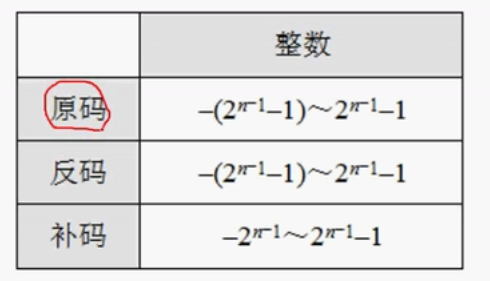

软件设计

下午1、数据流2、数据库3、UML数据库4、算法5、java


```
6分  计算机体系结构
```

进制转换 

任意进制 转 10进制


任意进制转 2进制


2进制  转 8  16进制

2进制对 8进制   1对3  二的三次方，从右三位分段，取值为1 的  2的几次方从0开始

2转16  1对4  二的四次方 从右分4段 取1的2的几次方

 1-9 A10 B11 C12 D13 E14 F15 G16


原码  反码 补码 移码 

原码 8位 默认补0 第一位符号为  为1是负数  原码相加1 + -1  二进制相加 结果为-2   10000010 -2

原码不能直接运算 

反码  正数一样   负数 第一个符号位为1 剩下  按位取反 1111 1110 表示-1    1+ -1    二进制计算为负数  则结果为1111 1111 表示-0

补码 整数一样， 负数是反码的基础上加以 0000 0001 补码是 1111 1110 + 1 就是 1111 1111  1+ -1 就是 0 正确

移码用作浮点运算的阶码 移码是补码的基础上 符号位 取反 整数1 为 0000 0001  移码为 1000 0001 负数0111 1111    相加 为1000 0000   1是负数

反码是原码的颠倒， 补码是反码 加一  ，  移码是补码符号位取反  

原码  反码 补码 整数都一样  移码100表示整数一样， 就是第一位为0 ， 反码和补码一样 符号位取反

原码反码补码表示范围 ： 一个字节8个位的原码取值范围是多少十进制

