# 保险

家庭保险

人寿  重疾 意外

抵抗金融风险

安全线第一档就是偿付能力要高于150%

如果你买了平安的重疾险保单，那一定是“平安人寿”  因为它持有财产险牌照，你保险合同上敲的合同章肯定是“中国平安财产险股份有限公司”的

+ 安邦保险、前海人寿二级市场

# me 油泥 造物族

前后端token

四季

hobbymax kiking  木匠 皮匠 人偶

木那 工作室

造物主

black 13 park

手办制作 https://www.guokr.com/blog/479710/


# esp8266

+ https://www.espressif.com/zh-hans/support/iot-college/video  esp8266官网视频
+ mac esp工具链 https://esp-idf.readthedocs.io/zh_CN/latest/get-started/macos-setup.html

```

sudo easy_install pip
sudo pip install pyserial

https://pypi.org/project/wget/
python -m wget https://dl.espressif.com/dl/xtensa-esp32-elf-osx-1.22.0-75-gbaf03c2-5.2.0.tar.gz

tar -xzf ~/Downloads/xtensa-esp32-elf-osx-1.22.0-75-gbaf03c2-5.2.0.tar.gz
export PATH=$PATH:$HOME/git/learn/esp8266/esp/xtensa-esp32-elf/bin
alias get_esp32="export PATH=$PATH:$HOME/git/learn/esp8266/esp/xtensa-esp32-elf/bin"


```


# 2018-07-05 php 移动端

+ iscroll


#2018-07-03 php 项目

+ 接口文档 apizza

+ <label for='username'> 焦点 for 

+ 表单序列化

  ```
  arr = $('form').serializeArray()
  for(i in arr){
      arr[i].name 
      arr[i].value
  	putData[name]=value
  }
  $.ajax({
      type:'POST',
      url:'',
      data:params,
      dataType:'json',
  })
  ```

  ​         


# 2018-06-30 php 跨域资源共享

+ 阅览器 提示 跨域 但有数据 ， 需要服务端发送header数据
+ jsonp 只支持 get场景 数据量大，前后端 都需要修改
+ cors 跨域 只需要该 服务端 ，客户端不需要配置
+ 夜神  海马玩模拟器
+ 文件上传 jquery -fileupload    jq22.com
+ 


# 2018-06-28 jquery 模板引擎


+ ajax 获取数据只能用事件委派

  

  ```
  不同源 跨域
  ```

  


​	作业 请求 360 搜索接口的数据 通过script 标签 so.com

 + 流程图 xmind www.draw.io  mxgraph.js
 +  axure需求原型
 + 挂号平台  身份证 卖给黄牛
 + 区块链 dapp
 + 以太坊 solidity


# 2018-06-25 php xml json

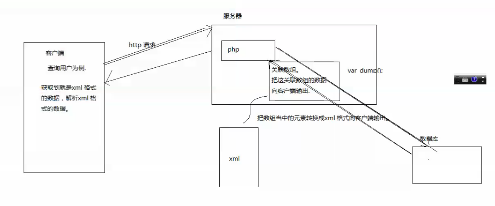

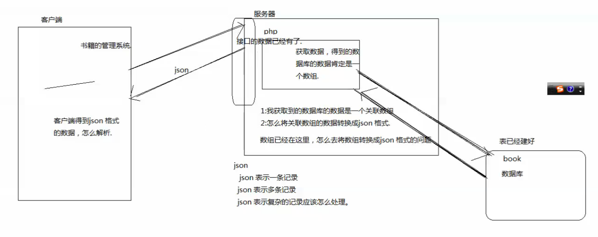


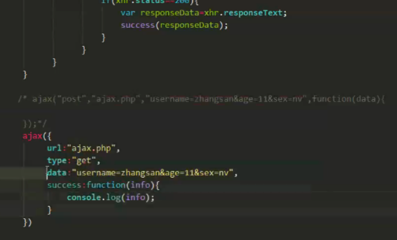


# 2018-06-23 session 

## php_session

```
$username=''

$_SESSION['username']
session_start();
echo $_SESSION['username']

```

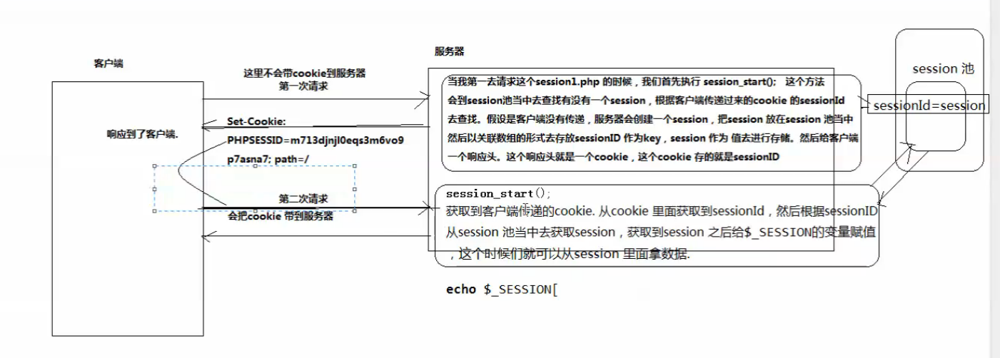


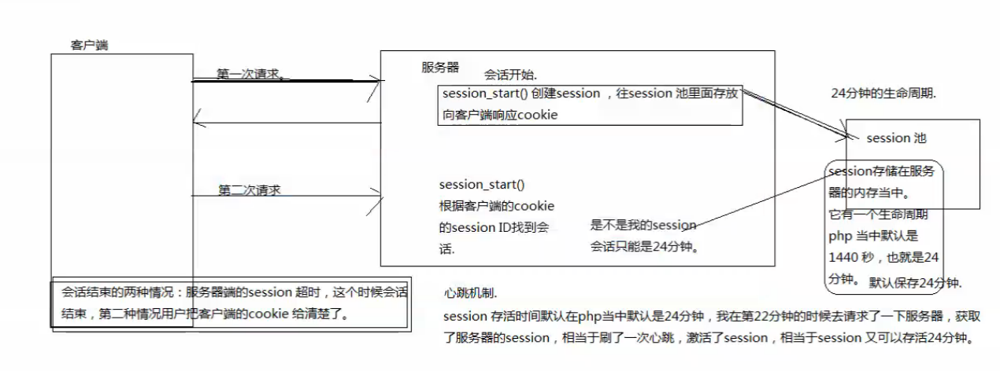


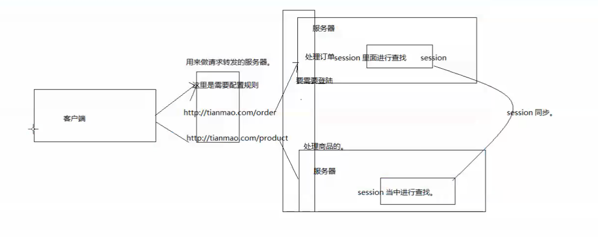

### 请求转发

+ cookie 存储在客户端 ，服务器 

+ sessionStroage   客户端 本地存储 生命周期 关了阅览器就没了

+ localStroage  客户端 本地存储    关了不会  上一次播放时间

+ seeion   存储在服务器 以来cookie

+ 老师有个困惑？企业内有一个统一认证中心， 我的服务器判断session中是否包含用户信息，没有的话，我的服务器通过302跳转到认证服务器，后认证服务器再跳转到我的服务器，回来的请求为什么我的服务器可以直接获取到认证的用户名 身份信息

  

  

### session 案例

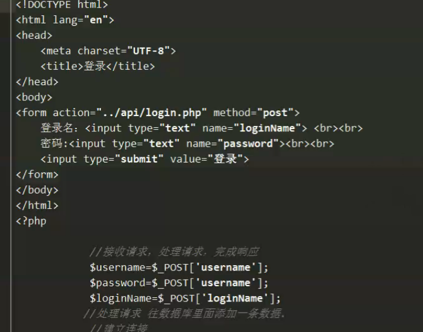


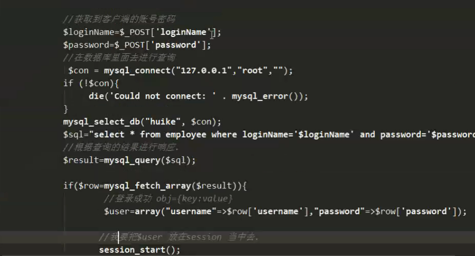

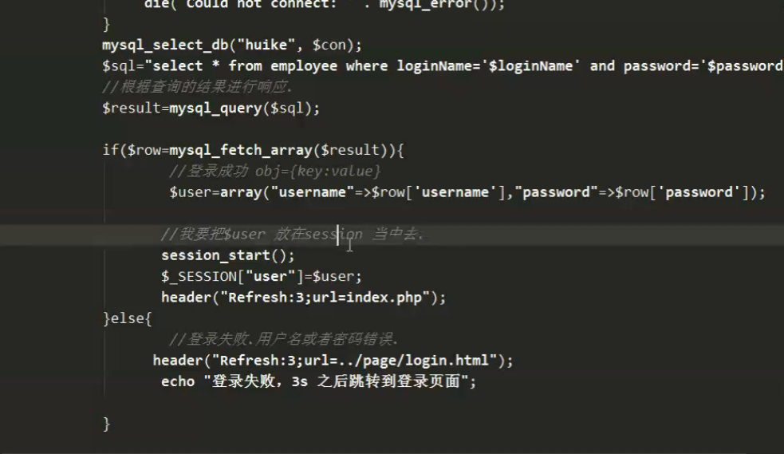

登录验证

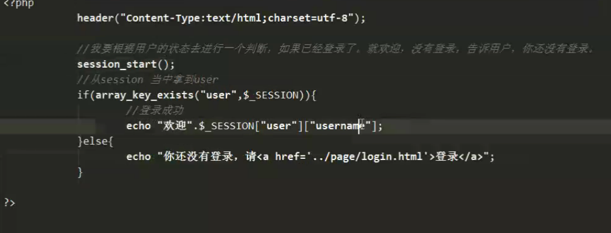

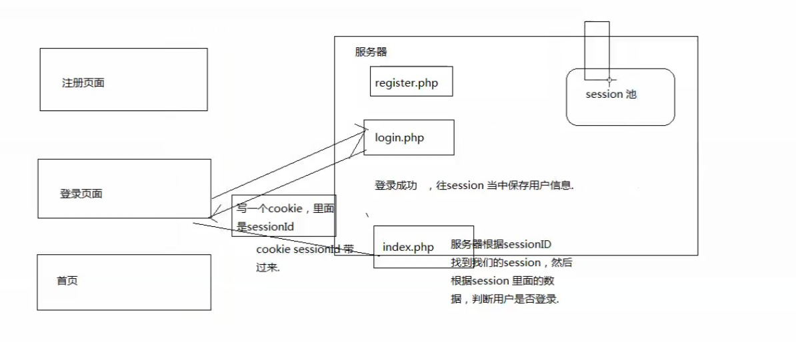


### ajax

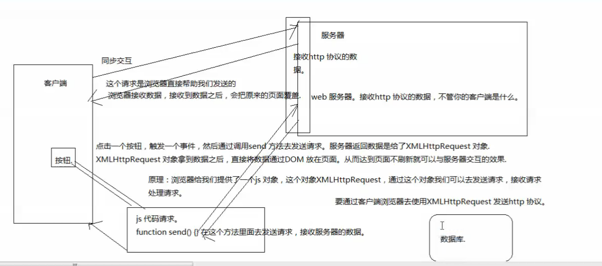

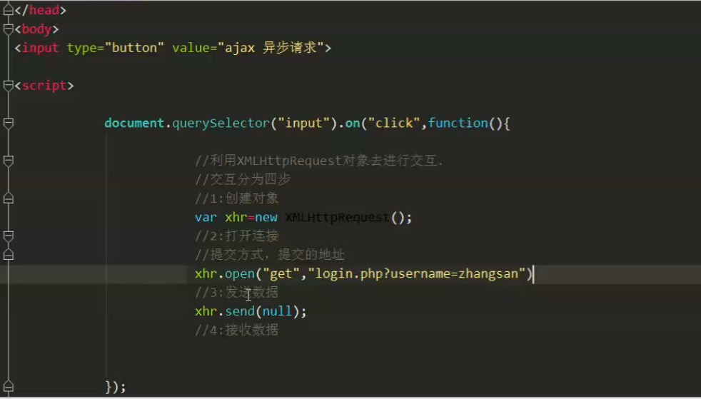

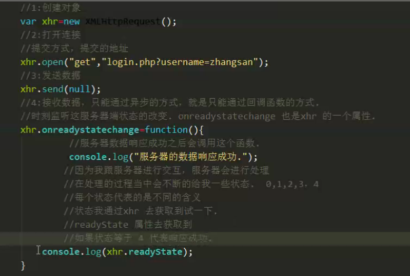

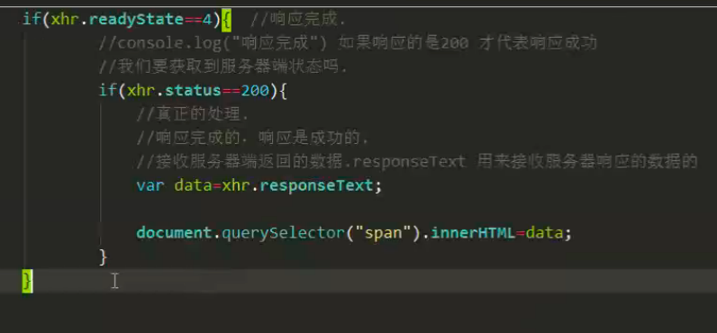

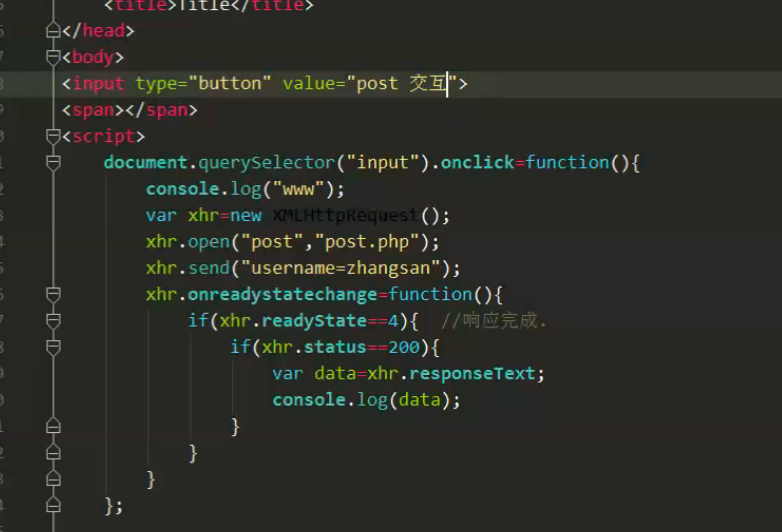


#####post 需要提交特殊的请求头

content-type application /x-www

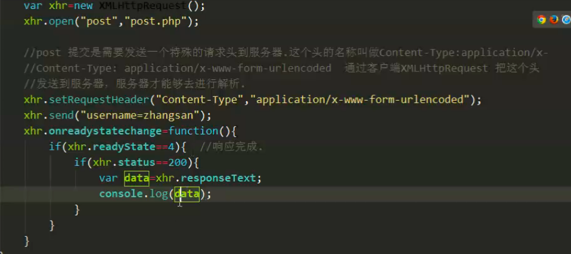


# Begin


## 获取元素

- 获取一个
- 获取全部元素
- 操作类样式 添加 移除 切换

## data- 自定义属性
懒加载 使用？？？
自定义属性  和 绑定id 对应
3点 如何获取 如何设置 

## 文件读取 api
- input file
  - one change 事件
     input.onchange=function(){
		for(){
		}
	}
     读取文件加载文件 onload 异步事件

#获取网络状态
- window.navigator.ononline
- ononline
- onoffline 事件 触发条件

#获取地理定位
- window.navigator.geolocation 经纬度 只能获取一次
- 实时获取位置消息

## 本地存储
- local  永久 20M  页面共享
- session 当前浏览器有效 
- window.localstorage.setitem get remove clean

## 操作多媒体  作业
- Dom 参考
- 完成一个在线播放器 网页云音乐 播放 下载 快进 跳播功能时间对应

## canvas
- 统计图 
- 小游戏  数据处理 图像处理
- 1.落笔坐标点 2.连线 3.描边 stroke()
- stroke()  多个 会重绘 描边 
- fill 填充 
- 非零环绕原则 正时针绘制 逆时针绘制 方向相反 射线 相交越少越好
  - 闭合 而且方向相反 点 射线 相交 +1 -1 为0 进行填充 顺逆时针
- biginpath（） 开启新图层  ctx.beginPath
- linewidth 线宽
- 虚线 ctx.setLineDash（【实线，空白，实线，空白】）
- 绘制动画 
  - rect 矩形
  - content.clearRect 清除

--作业：
	1. 从200,100的位置绘制宽为200高为150的矩形
        2. 准备一个600*400的画布，三等分这个画布，分别绘制正方形。直角三角形，梯形
- 线性渐变
- 绘制文本 填充文本 描边文本
- 绘制图片 content.drawImage   添加onload 事件后再开始绘制
	- 截图 绘制到哪
	- 不失真 宽高比
- 弧度 content.arc  绘制o度角 3点 角度为起点 往下6点90度为整网上为负 
	- 弧度制  math.pi*3 度  cos math.cos()*100
- 平移 ctx.translate
- 旋转 

## typora
#markdown
	- https://www.zybuluo.com/mdeditor


# 20180529 js 构造函数
function fn(name){
	this.name = name
}
var _n = new fn('小明');

## 构造函数方式2  重点jQuery 核心 原型
属性查找规则
1、变量声明了未赋值才是undefined 2、属性不存在也是undefined

上下文调用方式   最强大
call apply bind
function f1(){
	console.log(this)
}

只有对象才有原型
//第一个参数决定 this的值
f1.call([1,2,3])

bind 延迟执行  call apply 执行过程中绑定了 this值
动画 canvas 延迟函数 
setTimeout(function(){
	console.log(this)	
},50)
call、apply是立刻执行了这个函数，并且执行过程中绑定了this的值
bind并没有立刻执行这个函数，而是创建了一个新函数，新函数绑定了this的值
课外作业 5.29  思考bind 如何实现  如何解决浏览器的兼容问题


# es6
> 模板字符串
- var s1 = `111`
- 解决痛点  字符串拼接
- var s1 = `hello ${name}`
```
	var a = `<div>
			<span></span>
		 </div>`
```
- app 开发 react native？weex？
> 解构赋值
```
	获取对象
	var obj = {name:'aa',age:18}
	let { name,age } = obj;  //obj.name 创建了两个变量
```
- 减少全局变量污染?
- 有什么作用  可以节省一二写字符
```
	//使用结构赋值
	function fn(option){
		//option.width
	}
	fn({
		width:100,
		height:100,
		age:50
	})

	//接受对象自变量  局部变量
	function fn_2({ width,height,age}){
		console.log(width,height,age)
	}

```
- 其他用法
```
	var { name:obj2Name } = obj  //创建新变量 obj2Name
```
- 属性的简写
```
        var a = 3 ; var b = {a} ; console.log(b); // {a:3}
	var c = 4
	var d = {a,c}
        {a} === {a: a}
```

> rest 参数
```
	function fn(){
		//arguments 函数内部局部变量  调用函数传递的是实参数
		console.log(arguments.length)
		//第一个实参
		console.log(arguments[0])
		for(i in arguments){
			console.log(arguments[i])
		}
	}
	fn(1,2,3,4,5)
```
- es6 箭头函数内部不能使用arguments
		- rest 参数弥补这个问题
```
	// ...args rest参数的使用方式
	//产生了一个变量，是数组，包含所有实参
	function fn(...args){
		//验证数组
		console.log(args instanceof Array)
		console.log(Object.prototype.toString.call(args))  //"[object Array]"
		console.log(Array.isArray(args)) //es5 方法
		console.log(args)
	}
	fn(1,2,3)
```
+ typeof
	- typeof 智能判断 数字 字符 布尔 undefined 函数
+ Object.prototype.toString.call()
	- 5 '[object NUmber]'
	- [object String]
	- [object Boolean]
	- [object Null]
	- [object Undefined]
	- [object Array]
	- [object Function]
	- [object Date]
	- [object RegExp]
> 箭头函数
- 箭头函数就是为了绑定匿名函数
```
	//无参匿名函数
	div.onclick=function(){}
	div.onclick=()=>{}
	//有参数
	var fn=name=>{console.log(name)}
	var fn=(name)=>{}
```
> 匿名函数
```
	var status = [1,2,3]
	status.forEach(function(value,index){
	})
	status.forEach(value=>{
	})
```
+ 阮一峰
+ 箭头函数和匿名函数有哪些不同？  重点
	- 函数 作用域
	- 箭头函数不能作为构造函数
	- 不可以使用arguments对象
	- 不可以使用yield命令
	- Generator函数经常用async替代
```
	var p={
		age:18,
		run:()=>{
			setTimeout(()=>{
			 //默认指向this windows方法
				console.log(this)
			},1000)
			//外层函数 作用于是全局作用域
		}
		say:function(){
			setTimeout(()=>{
			 	//默认指向p对象 
				console.log(this)
			},1000)
		}
		//es6为了解决这种问题

		//es6对象方法简写  推荐使用的匿名函数书写方式
		say(){
			console.lg(this)
		}
	}
```

+ 实际中用ES6的话,兼容性上是不是不太好? 用bable插件

> bable 插件 https://www.babeljs.cn
+ vue 脚手架 vue-cli内置了babel，如果需要可以修改兼容版本

## vscode 好看简洁 强大 sublime webstorm
+ https://marketplace.visualstudio.com/items?itemName=ruakr.ftp-kr
+ https://www.javascriptcn.com/read-7177.html

## mnd 开发社区
+ https://developer.mozilla.org/zh-CN/


# 20180531 JS高级
## bind方法实现
+ 1、bind方法放在函数的原型中
```
	Function.prototype._bind = function(target){
		return function(){}  //不可以
		//利用闭包 创建内部函数  返回新函数
		return (function(){
			//执行fn里面的逻辑
			this.call(target);
		})()
	}
	function fn(
		console.log(this)
	){}
	fn.bind({age:18})
	var _f3 = fn.bind({age:11})
	_f3()
```

##对象的扩展
```
	Object.assign 对象的浅拷贝
	var source={age:18,height:170}
	//克隆新对象
	var target={};
	var newObj = Oject.assign({},source)
```


## 回调地狱 Permise
```
	function f1(){
		setTimeout(()=>{
			console.log(1)
		},1000)
	}
	function f2(){ return new Permise(resolve=>{
		//告诉外界我已经执行完了
		resolve()
		})
	}
	f1().then(res=>{
		return f2();
	}).then(res=>{
		return f3();
	})
```
+ promise es6  sync es8
+ rxjs
+ Promise 错误处理方式
```
	function getPromise(fn){
		return new Promise(resove=>{
			$.get('/apie',function(res){
				//res
			})

		})
	}
	getPromise().then(res=>{
		//res 服务器中获取数据
	})

	function getPromise(fn){
		return new Promise(resove=>{
			$.ajax({
				url:'/api',
				success(res){
					resolve(res);  //成功
				},
				error(res){
					reject(resError); //失败处理
				}
			})

		})
	}

	getPromise().then(res=>{
	
	},resError=>{
		console.log(resError)
	})
	//第一个参数成功回调   第二个参数 失败回调


	第二种错误处理方式
	getPromise.then(res=>{
		//成功
	}).catch(resError=>{
		//失败
	})

	//区别 ，推荐第二种
	//第二种 强大  不仅仅可以捕获到 reject 传递的参数
	//还可以捕获到 成功的毁掉中发生的错误

```
+ catch
```
	function f1(name){
		return new Promise((resolve,reject)=>{
			setTimeout(()=>{
				if(name=='a'){
					resolve('成功')
				}else{
					reject('失败')
				}
			})
		})
	}
	f1('a').then(res=>{console.log(11111)})
	f1('a').then(res=>{
		console.log(11111)
		var a=5;
		a();  //代码发生了错误
	}).catch(res=>{
		console.log(res);
		//成功中失败的代码也能捕获
		
	})
```
## async
```
	(async function(){
		//异步操作 函数f1()
		await f1();
		console.log('第一步')
		await f1();
		console.log('第二步')
	})()


	function q(){
	    return new Promise((resolve)=>{
		setTimout(()=>{
			resolve("hi")	;
		},1000)
	    })
	}
	(async function(){
		const res = await q();
		let res = await q();
		const res1 = await q();
	})()


	var p = {
		say:async ()=>{
			await q();
		},
		run:async function(){
			await q();
		}
	}

    try{
	(async ()=>{
		let res = await p.say();
		console.log(res)
		await p.run();
	})()
    }catch(e){	
	console.log(e)
    }

```
+ async 处理返回值
	- let 
	- const
```
	async function get(){
		var let res = await  timer()
	}
	get()
```
+axios 也可以异步操作


## class 类语法  原型继承的根
```
	function a(name,age){
		this.name = name;
		this.age = age;
	}
	one = new a('hao',12)
	//类的样式
	class p{
		//构造方法
		constructor(name,age){
			this.name = name
			this.age = age
		}
	}
	var s = new p('hao',18)
```
+ class 类的方法
```
	function p(){
	}
	p.prototype.run=()=>{
		console.log('run')
	}
	class s{
		constructor(age){
			this.age = age
		}
		run(){
			console.log(`run class ${this.age}`)  //模板字符串
		}
		static down(){
			console.log('class 类的静态方法')
		}
	}
	var s1 = new s(18);
```
+ 类的静态方法 static down(){}
	- p.down()
+ 类的静态属性  通过自身属性访问的this static down(){}
	- p.age
+ 类的继承  (原型继承）
```
		class p{
			constructor(name){
				this.name = name
			}
		}
		class a extends p{
			constructor(){
				super(name);  //调用父类构造方法
				//通过super 继承了name属性
				this.age = age //自身构造属性
			}
		}
```

## model 模块
## 框架封装

#20180603
#sources 断点 调试行
```
function f1(){
	console.log(age)
	var age=18;
	console.log(age)
}
var length=100;
f1();
```
+ 变量作用域取决于作用域所处的范围 
	- 页面加载完成

# mpvue 小程序项目？？？？
# 项目实战 封装库
+ 不依赖第三方库
+ 隔绝  只有$ jQuery

```
	(function(){
		function jQuery(){
		}
	})(window)
	//window.$ = window.jQuery = jQuery;
	//相当于
	window.jQuery = jQuery;
	window.$ = jQuery;
```

+ 获取div属性
```
	(function(){
		function jQuery(){
		}
	})(window)
	//window.$ = window.jQuery = jQuery;
	//相当于
	window.jQuery = jQuery;
	window.$ = jQuery;
```
#$ css 封装实现
#$.extend   拷贝继承 和 属性继承
+ obj1  obj2 的属性一一赋值obj3
+ 使用es6对象扩展运算符，改写extend方法

# 20180610
+ 正则表达式
```
	字符集合
	[] 匹配一个字符  /[1a2b3]/;
	var reg1 = /[123][abcd]/  匹配两组字符
	reg1.text('2a');

	[^]
	var reg1 = /[^123]/  字符中不只包含 1 、2 、3
	reg1.text("a");
```

### 作业
```
	识别 $("#aa")  $(".aa")  $("span")
	"123asdfafeij1232".replace(/\d/g,"")
	只替换字符串的前后空格
	" 123asdf  afe ij1  232 ".replace(/\s/g,"")
```
# 模块化 mvvm 框架  
/^\.\w/.test('.a_c')
我的电脑  22:05:12
/^\#\w/.test('#abc')
我的电脑  22:21:46
/^\w/.test('abc')


## 作业1
### jquery：选择器引擎：Sizzle大量的使用了正则表达式
```js
    $("#abc")   //id
    $(".abc")   //类
    $("span")   //标签
    /^#/.test('#abc')
    /^\./.test('.abc')
    /^\w/.test('abc')
```

## 作业2：写一个正则表达式，用于替换一个字符串的前后空格
+ 比如："   asdffsf  asdfasfsd asfas a "替换为"asdffsf  asdfasfsd asfas a"

"    asdffsf  asdfasfsd asfas a ".replace(/^\s{1,}([\s\S]*?)\s{1,}$/,'$1')

### require 解决循环依赖问题


# php
## lamp 
+ https://blog.csdn.net/maia007/article/details/52133789?locationNum=9&fps=1
```
sudo apachectl start
/etc/apache2/http.conf
LoadModule php5_module libexec/aache2/libphp5.so
sudo apachect1 restart
php -v
/Library/WebServer/Documents
<?php phpinfo(); ?>

```

# php
```
/Users/chenhaohao/git/learn/web
http://127.0.0.1/web%E5%85%A8%E6%A0%88/20180616_php/day_01/code/01.php
http://127.0.0.1/web全栈/20180616_php/day_01/code

mac lamp 
https://blog.csdn.net/maia007/article/details/52133789?locationNum=9&fps=1
配置mysql mac mysql dmg
vi /etc/paths  添加环境变量
sudo mysqladmin  -u root -p password

```
+ https://blog.csdn.net/li396864285/article/details/51939423
```
没有后端基础

张亚军
我UI，前端懂一点，
```

