# 保险

家庭保险

人寿  重疾 意外

抵抗金融风险

安全线第一档就是偿付能力要高于150%

如果你买了平安的重疾险保单，那一定是“平安人寿”  因为它持有财产险牌照，你保险合同上敲的合同章肯定是“中国平安财产险股份有限公司”的

+ 安邦保险、前海人寿二级市场

# me 油泥 造物族

前后端token

四季

hobbymax kiking  木匠 皮匠 人偶

木那 工作室

造物主

black 13 park

手办制作 https://www.guokr.com/blog/479710/


# mongoose os

```
curl -fsSL https://mongoose-os.com/downloads/mos/install.sh | /bin/bash
~/.mos/bin/mos --help      
~/.mos/bin/mos

```

# WS2812B

+  可编程 灯带


# esp8266

+ https://www.espressif.com/zh-hans/support/iot-college/video  esp8266官网视频
+ mac esp工具链 https://esp-idf.readthedocs.io/zh_CN/latest/get-started/macos-setup.html

```

sudo easy_install pip
sudo pip install pyserial

https://pypi.org/project/wget/
python -m wget https://dl.espressif.com/dl/xtensa-esp32-elf-osx-1.22.0-75-gbaf03c2-5.2.0.tar.gz

tar -xzf ~/Downloads/xtensa-esp32-elf-osx-1.22.0-75-gbaf03c2-5.2.0.tar.gz
export PATH=$PATH:$HOME/git/learn/esp8266/esp/xtensa-esp32-elf/bin
alias get_esp32="export PATH=$PATH:$HOME/git/learn/esp8266/esp/xtensa-esp32-elf/bin"


```

# nodejs 2018-07-31

> 模板继承   引包  头部 底部

```
{{include './particals/linker.html'}}   引用文件  头部

{{block 'content'}} 中部留坑 {{/block}}
{{extend '/xx.html'}}


```

> 配置文件参数引用

```
let {appPort} = require('./config')


```


# nodejs 2018-07-19 mongodb

> mongodb 安装

+ 下载地址  https://fastdl.mongodb.org/osx/mongodb-osx-ssl-x86_64-4.0.0.tgz
+ 命令

```
db.users.update({name:'aaa'},{$set:{count:'china'}})
查询
db.users.find() 显示所有
db.users.find({name:'aaa'})
db.users.find({score:{$gt:80}})
分页
db.users.find().skip(0)  跳到第几条
db.users.find().skip(2).limit(3)  显示第3条
排序
db.users.find().sort({'score':1}) -1降序
正则
db.users.find({name:/红$/})
聚合
db.users.update({name:/够/},{contry:'哈哈'})

db.inventory.find() 仓库
db.inventory.insert()
db.orders.aggregate([
    {
        $lookup:
        {
            from:'aaa',
            as:'bbbb'
        }
    }
])

https://www.sinya.online:3400
https://www.sinya.online:3400/list
```

> 经纬度

https://www.sinya.online:3400

https://www.sinya.online:3400/list


> mongoose 面向对象的方式


> 公私钥 https

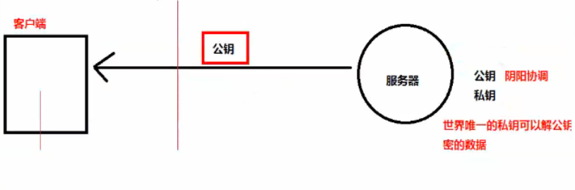

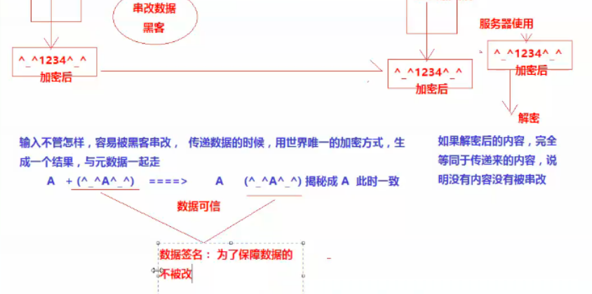

+ 服务器 到 客户端 》私钥加密  公钥解密

+ 客户端  到 服务器 》 公钥加密 私钥解密

  + 保证 客户单 到  服务器 消息不被篡改 通过签名   加密 的加密   服务器 解密  和 解密 校验

  + 防止黑客伪造  请求携带证书   ca 颁发证书

    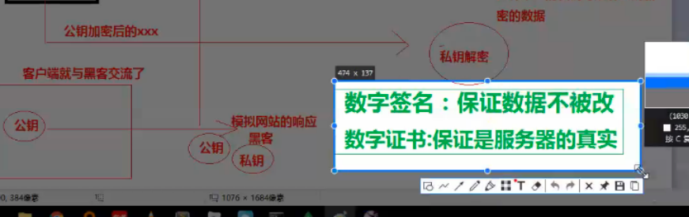

+ cert

> 附近的人

+ 数据库帮我们计算距离

  + 调用api

  + 存储节点

    + 使用索引  指定字段  描述

    + 相当于 数据的目录

      ```
      创建索引
      ```

      


# nodejs 2018-07-17 express

> express

```
const express = require('express')
let app = express();
let router = express.Router();
app.listen(8888,()=>{
    //启动完成
})
app.use('/url',(req,res,next)=>{  //按代码顺序执行
    console.log('url1')
    next()  //继续   当没 写返回
}) //一件事

app.use('/url2',(req,res,next)=>{  //按代码顺序执行
    console.log('url2')
    next()  //继续   当没 写返回
}) //一件事
	
```

> 应用级中间件
>
> 路游级中间件

```
const express = require('express')
let server = express();
let router = express.Router();


router.get('/demo',(req,res)=>{  //按代码顺序执行
    console.log('url1')
    res.end('login')//页面返回
}) //一件事
.get('/logout',(req,res)=>{
    res.end('logout')
})
.get('/json',(req,res)=>{
    res.json([{name:'aaa'}])
})
.get('/redirect',(req,res)=>{
    res.redirect('http://www.baidu.com')  
    //重定向 是服务器给浏览器的302的标识
    //服务器 返回windows.location 地址 ，浏览器根据location请求
})
.get('/jsonp',(req,res)=>{
    res.jsonp('jsonp')
    // http://127.0.0.1:8888/jsonp?callback=jsonpcallback
    /*
    	/**/ typeof jsonpcallback === 'function' && jsonpcallback("jsonp");
    */
})
.get('/download',(req,res)=>{
    res.download('http://www.baidu.com')
    //res content dispostion : attachent
})


server.use(router)
server.listen(8888)
```

+ 模板引擎

  ```
  const express = require('express')
  let server = express();
  let router = express.Router();
  
  server.engine('.html',require('express-art-template'))
  
  server.set('view engin','.html')
  
  router.get('/login',(req,res)=>{  //按代码顺序执行
      console.log('url1')
      res.end('login')//页面返回
  }) //一件事
  
  
  
  
  server.use(router)
  server.listen(8888)
  ```

  ```
  imports.num:{{num}}
  imports.reverse {{re}}
  ```

  

+ 日志界别

  + debug 不压缩 不混淆代码  实时更新
  + 非debug  压缩 合并 list.html静态数据不实时更新

  ```
  server.set('view options',{
      debug: process.env.NODE_ENV !== 'production',
      imports:{
      	//数据的导入 过滤显示的操作
          num:1,
          reverse:function(str){
          	return '~.~'+str+'~.~
          }
      }
  })
  ```


> 第三方中间件  body-parser

```
const bodyParse = require('body-parser')
app.use(bodyParser.json())
```


+ 静态资源

```
router.use('/public',express.static('./js'))
```

+ 错误处理

```
router.get('/',(req,res,next)=>{
	console.log(req.url)
    let errorPath = './abc/e.txt';
    try{
        fs.readFileSync(errorPath);
        res.render('index');
    }catch(err){
        //throw err; //暴露给用户
        next(err)
    }
})

//最后的一条路由 都给你处理
.all('*',(req,res)=>{
    
})
//处理错误
server.use((err,req.res.next)=>{
    res.send('<h1> 亲爱的用户，访问出现问题</h1>')	//显示html  自动判断 utf8 处理
})

```

> 例子

nodemon ./xxxjs 会自动重启服务器

+ 展示用户列表页面 （页面中请求js)

  ```
  //处理图片 中间件
  let heros =[
      {name:1111,img:'imgs/1.jpg'},
      {name:2111,img:'imgs/2.jpg'}
  ]
  server.use(e'x'press)
  route.get(/)
  route.
  
  解析文件 模块
  formidable  //接近原生
  express-formidable
  koa-formidable
  const path = requse()
  form.uploadDir = path.join(__dirname,'public','imgs')
  form.keepExtensions = true;
  
  .post('/add'()=>{
      ver form = new formidable.In....
      form.parse(req,function)
  })
  
  ```

  

  ```
  {{each heros}}
  	<li>
  		{{$value.name}}
  		
  	</li>
  {{/each}}
  <form action="/add" method="post" enctype="
  ```

  


> browerHistory ???? 前端路游  vue 后讲

# nodejs 2018-07-14  

> 遍历文件夹

+ 嵌套层级过深  fs.access()

+ http://nodejs.cn/api/fs.html

  + 接收参数
  + 修正路径
  + 判断文件是否存在
  + 判断文件夹 还是 文件
  + Package.json 包的说明文件
  + npm  init  -y
  + Npm install  art-template jquery —save 记录依赖

  ```
  const path = require('path')
  const fs = require('')
  testReadFIles(dir){
      let inputPath = path.resolve(process.argv[2])
      try{
          fs.accessSync(inputPath,fs.constants.F_ok)
          let state = fs.statSync(input);
          if(state.ifFile()){
              console.log(inputPaht)
          }else if(state.isDirectory()){
              let files = fs.readdirSync(inputPath);
              console.log('是一个文件夹')
              files.forEach(file =>{
                  testReadFIles(path.join(dir,file));
              })
          }
      }catch(e){
          console.log(e)
  
      }
  }
  ```

  + 删除依赖 

  ```
  dependecies:{}
  ```

+ 凡事通过 require 引入的包 都是要使用对象的属性

  ```
  const myobj = require('./obj.js')
  ```

+ sudo npm install  http-server -g

  ```
  sudo npm install   http-server -g
  /usr/local/bin/hs -> /usr/local/lib/node_modules/http-server/bin/http-server
  /usr/local/bin/http-server -> /usr/local/lib/node_modules/http-server/bin/http-server
  + http-server@0.11.1
  added 25 packages in 9.751s
  ```

+ npm yarn

  + 离线缓存
  + 镜像源的选择

+ nrm 是npm 的镜像源管理工具

  + nrm  add http
  + nrm  use taobao
  + nrm ls
  + npm i jquery
  + npm i  -g pm2

+ nrm  cnpm是淘宝私有

+ nvm  切换node 版本档次不高   ，安装低版本 修改路径，使用时修改全局变量

  ```
  const jq = require('jquery')
  console.log(require.resolve('jquery'))  //获取包入口路径	
  ```

  

> http 核心模块

+ 故事剧情 

  + 5大特点

    + 简单 轻

    + 无连接（不为每一个请求保持）

    + 无状态（服务器不记得用户是谁）cookie

      

```
const http = require('http')
let server = http.createServer()
server.on('request',(req,res)=>{
    res.end('xxxxxx')
    console.log(req.headers)//头
    console.log(req.url) // 行
    console.log(req.method)  // 行
    req.on('data',(data)=>{
        console.log(data.toString())
        //写头 1、一次写 2、多次写
        res.writeHeader('a','a')
        res.writeHeader('a','a')
        res.writeHeader('a','a')
        res.writeHead(200)'
        
        res.write('aaaaaaa')
        res.write('bbbbb')
        res.end('zzzzz')
    })
    
})
server.listen(8888,()=>{
    console.log('服务器启动888端口')
})

node web.js
http://127.0.0.1:8888/

```

1、进行中

2、完成

3、重定向

4、客户端异常

5、服务器异常

> 接口

```
const http = require('http')
const fs = resquire('fs')
http.createServer((req,res)=>{
    if(req.url === '/'){
        fs.readFile('./index.html',(err,data)=>{
            res.writeHead(200,{'content-type':'text/html;charset=utf-8'})
        })
    }else if (req.url === '/test' && req.method === 'GET'){
        res.write
    }
})

<html>
	<body>
		<button id = 'btn'>点我<btn>	
		ajx
	</body>
</html>
```

+ readState
  + 1 建立连接
  + 2 数据处理

> Koa2  mysql mongodb express


> postman工具


> mongodb

> Webpack


# nodejs 2018-07-12	刘

+ 安装

  ```
  This package has installed:
  	•	Node.js v8.11.3 to /usr/local/bin/node
  	•	npm v5.6.0 to /usr/local/bin/npm
  Make sure that /usr/local/bin is in your $PATH.
  
  ```

  ```
  node -v
  node console.js
  ```


+ 对象  

  + 全局 对象

    + Process.env 环境变量

    + 

      ```
      console.log(process.env)
      ```

      

  + 核心 引用 服务器所能达成的需求

  + 自定义对象


+ 接受命令行参数

  ```
  console.log(process.argv)
  node -v
  node -h
  
  let num1 = process.argv[2] - 0
  let num2 = process.argv[3] - 0 //parseInt
  let sum = num1 + num2
  setTimeout(()=>{
          console.log(num)
  },2000)
  
  
  ```


+ 实现规范

  + commonjs  common定义后端规范

    ```
    
    __dirname 目录
    __filename 绝对文件路径
    
    一个文件一个模块
    依赖一个模块 require('memodule
    数据返回 module.exports 
    
    
    ```

  + path

    ```
    const path = require('path')  //path核心对象
    //拼接路径
    const mypath = path.join(__dirname,'//one//','//two//','//three///')
    console.log(myPath)
    
    获取文件绝对路径
    str = './//abc////efg.js'
    let myth = path.resolve(str)
    //拆分路径
    let myth2 = path.parse(myth)
    //修改文件名
    myth2.base = 'rename2.txt' 
    
    //接受路径
    path。format(myth2)
    
    
    ```

+ 模块

  + 模块的引用顺序
  + 命名冲突
  + commonjs规范解决了这些问题
    + 一个文件一个模块
    + 模块变量 内部作用域


+ 操作文件对象  fs文件模块

  + const fs=require('fs')

  + fs.read

    ```
    //引入核心对象
    const fs = require('fs')
    // err => Error|| null 两个对象
    fs.readFile('./a.tf8','utf8',(err.data)=>{
        if(err) throw err; //抛到控制台
        console.log(data);  //打印是buffer 16进制 进制越大存储字符越少
        //获取字符串数据 toString()  utf-8 GB2312
        console.log(data.toString('utf8'))
        //i o 输入 输出
    });
    
    //fs.writeFile(path,data||string,callback)
    fs.writeFile('a.txt','data',(err,)=>{
        //windows目录层级深，写入会报错
        if(err) throw err;
        console.log('ok')
    })
    
    //追加 方式1 appendFile(path,data,callback)
    fs.appendFile('a.txt','追加内容',(err)=>{
        if(err) throw err;
        console.log('追加成功')
    })
    //追加方式2	flag r w a
    fs.writeFile('a.txt','data',{flag:'a'},(err,)=>{
        //windows目录层级深，写入会报错
        if(err) throw err;
        console.log('ok')
    })
    ```

    + 此处为异步读写的

    + 有回调函数  和 没有   异步 和同步读写

      ```
      let data = fs.readFileSync('a.txt','utf8');
      console.log(data)
      fs.writeFileSync('b.txt',data)
      ```

      + 第一个读需要嵌套 后写入

      + 异步 和同步 比较的区别

        ```
        fs.readFileSync('mypath')
        //阻塞后续操作
        console.log('工作a')  被前面阻塞了，   
        //读完操作
        
        //立刻操作
        fs.readFile('mypath',()=>{
            console.log('ok')
        })
        console.log('工作b') 没有被阻塞，工作b 没有被延误
        ```

        + 异步不阻塞 后续代码执行

          > js 代码 执行时主线程  单线程

          + 计算机多核  同时执行  cpu读完之后返回一个状态

          + readfile了立刻做一个小标记， 昨晚后 再通知js单线程 叫他读文件   通过回调函数存取来

          + eventloop 时间循环  主线程 工作环境

            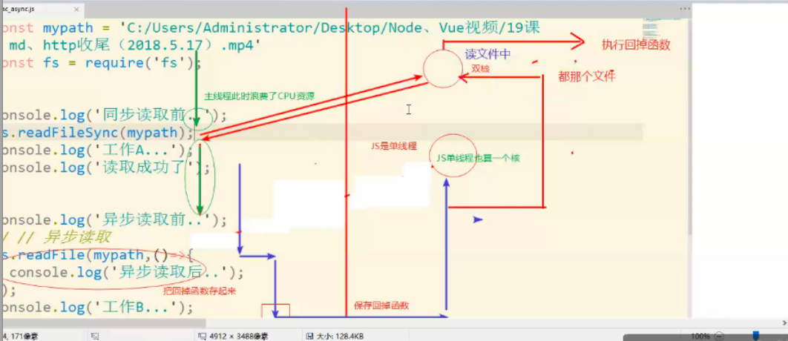

            + 异步函数执行后会把callback 放入事件队列,然后主线程继续运行，等callback运行完了，然后再交给主线程运行

              

> 同步异步
>
> ```
> kfc 买鸡腿  顾客a 反复问好了没
> kfc 买鸡腿  顾客b  去吃饭区
> 服务员只有一个人  厨房一群帮手
> b 把任务 告诉 服务员  b该干嘛干嘛
> 厨房主动送餐到服务区
> 
> 
> ```
>
> 

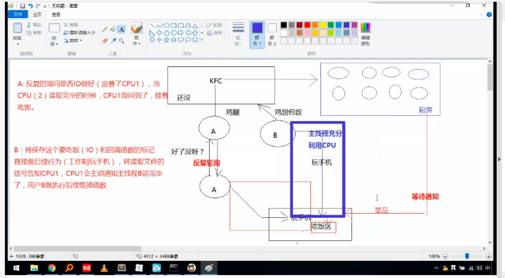


> 单线程 多线程
>
> 单进程 多进程

```
接受用户的请求报文 java 相应的时候 i o 同步机制 没写完需要等待
不跟 io 操作 先关的代码 不阻塞
cpu密集型   java 线程 内存开销大
io密集型	node 单线程 主线程 和工作线程
多个 访问请求  nginx 负载均衡  node io  java业务逻辑
```

```
http = require('http')
http.createServer((req,res)=>{
    res.end('启动888端口')
}).listen(888,()=>{
    console.log('服务器启动')
})

mac 安装nginx
ruby -e "$(curl -fsSL https://raw.githubusercontent.com/Homebrew/install/master/install)"

配置转发负载均衡
upstream www.baidu.com{
    server www.baidu.com:888 weight=1; 权重
    server www.baidu.com:999 weight=1; 权重越小越高
}

nginx.conf
http{
    server{
        listen 80
        server_name www.baidu.com
        location /tmp {
            # root html;
            # index index.html,index.php;
            proxy_pass http://www.baidu.com  配置代理
        } 
    }
}
start nginx
nginx -s reload
```


```
单线程的好处：
（1）多线程占用内存高
（2）多线程间切换使得CPU开销大   上下文切换
（3）多线程由内存同步开销
（4）编写单线程程序简单
（5）线程安全
 
单线程的劣势：
（1）CPU密集型任务占用CPU时间长
（2）无法利用CPU的多核
（3）单线程抛出异常使得程序停止

上下文
就是显卡啊，GPS啊什么的必须就位，然后CPU开始执行。这里除了CPU以外所有的就构成了这个程序的执行环境，也就是我们所定义的程序上下文

进程 cpu执行过程
先加载程序A的上下文，然后开始执行A，保存程序A的上下文，调入下一个要执行的程序B的程序上下文，然后开始执行B,保存程序B的上下文

线程是什么呢？
进程的颗粒度太大，每次都要有上下的调入，保存，调出。如果我们把进程比喻为一个运行在电脑上的软件，那么一个软件的执行不可能是一条逻辑执行的，必定有多个分支和多个程序段，就好比要实现程序A，实际分成 a，b，c等多个块组合而成。那么这里具体的执行就可能变成：

程序A得到CPU =》CPU加载上下文，开始执行程序A的a小段，然后执行A的b小段，然后再执行A的c小段，最后CPU保存A的上下文。

这里a，b，c的执行是共享了A的上下文，CPU在执行的时候没有进行上下文切换的。这里的a，b，c就是线程，也就是说线程是共享了进程的上下文环境，的更为细小的CPU时间段
```

>nodejs 单进程
>
>NodeJS是基于chrome浏览器的`V8`引擎构建的，也就说明它的模型与浏览器是类似的。我们的javascript会运行在单个进程的单个线程上。这样有一个好处：
>
>> - 状态单一
>>
>> - 没有锁
>>
>> - 不需要线程间同步
>>
>> - 减少系统上下文的切换
>>
>> - 有效提高单核CPU的使用率
>>
>>   

```
从严格意义上来讲，Node其实并不是真正的单线程架构，因为Node自身还有I/O线程存在（网络I/O、磁盘I/O），这些I/O线程是由更底层的libuv处理，这部分线程对于JavaScript开发者来说是透明的。JavaScript代码永远运行在V8上，是单线程的。所以表面上来看NodeJS是单线程的

进程是一个拥有资源的基本单元
进程存在父子关系  线程不存在父子关系，线程间可以相互创建
线程是操作系统中的一个基本调度单元
线程是进程中的一个实体   进程是任务的话 ，线程就是子任务
进程中至少包含一个或以上的线程

线程工作机制：
多线程运行在一个进程的相同地址空间内
优点：
1、创建撤销线程开销较小？  只需要控制线程池队列
进程则需要 上下文切换即 地址空间 保护和恢复进程状态所需资源 pcb表进程池，需要系统调用
2、进程间通讯需要内核参与：提供通讯机制、保护机制；线程在同一个地址空间内，共享主存和文件无需内核参与
```

> Nodejs 单线程 并发原理

```
我们可以用Ajax和Web Worker回应这个误解（javascript是单线程的，无法很好利用多核CPU）。当Ajax请求发送之后，除非是同步请求，否则其余的JavaScript代码会很快被执行到。在Ajax发送完成，直到接收到响应的这段时间里，这个网络请求并不会阻塞JavaScript的执行，而网络请求已经发生，这是必然的事。那么，答案就很明显了，JavaScript确实是执行在单线程上的，但是，整个Web应用执行的宿主（浏览器）并非以单线程的方式在执行。而Web Worker的产生，就是直接为了解决JavaScript与UI占用同一线程造成的UI响应问题的，它能新开一条线程去执行JavaScript

同理，NodeJS中的JavaScript也确实是在单线程上执行，但是作为宿主的NodeJS，它本身并非是单线程的，NodeJS在I/O方面有动用到一小部分额外的线程协助实现异步。程序员没有机会直接创建线程，这也是有的同学想当然的认为NodeJS的单线程无法很好的利用多核CPU的原因，他们甚至会说，难以想象由多人一起协作开发一个单线程的程序
```

> 死锁

```
先看生活中的一个实例，2个人一起吃饭但是只有一双筷子，2人轮流吃（同时拥有2只筷子才能吃）。某一个时候，一个拿了左筷子，一人拿了右筷子，2个人都同时占用一个资源，等待另一个资源，这个时候甲在等待乙吃完并释放它占有的筷子，同理，乙也在等待甲吃完并释放它占有的筷子，这样就陷入了一个死循环，谁也无法继续吃饭。。。
在计算机系统中也存在类似的情况。例如，某计算机系统中只有一台打印机和一台输入 设备，进程P1正占用输入设备，同时又提出使用打印机的请求，但此时打印机正被进程P2 所占用，而P2在未释放打印机之前，又提出请求使用正被P1占用着的输入设备。这样两个进程相互无休止地等待下去，均无法继续执行，此时两个进程陷入死锁状态

a 占用了打印机   b 占用了 输入摄像头  不释放 并 相互请求对方占用资源

死锁：是多个进程循环等待它方占有的资源而无限期僵持下去的局面

根源在于互相争夺资源  
```

+ 死锁产生条件
  + 互斥 	在一段时间 资源紧为一个进程所占用
  + 不剥夺      在使用过程中不可被其他进程使用
  + 保持         使用一个资源的同时，提出新的资源请求
  + 循环       等待     存在进程资源循环等待链
  + 

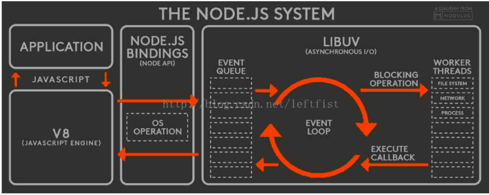


+ 原理

  ```
  智能地将一些涉及到IO、网络通信等耗时比较长的操作，交由worker threads去执行，执行完了再回调，这就是所谓的异步IO非阻塞吧。但是，那些非IO操作，只用CPU计算的操作，它就自己扛了，比如算什么斐波那契数列之类。它是单线程，这些自己扛的任务要一个接着一个地完成，前面那个没完成，后面的只能干等
  
  nodejs底层的libuv是多线程的线程池用来并行io操作)
  
  Threads 又称线程，他可以在同一时刻并行的执行，他们共享主进程的内存，在其中某一时刻某一个threads锁死了，是不会影响主线程以及其他线程的执行。但是为了实现这个模型，我们不得不消耗更多的内存和cpu为线程切换的开销，同时也存在可能多个线程对同一内存单元进行读写而造成程序崩溃的问题
  ```

> 用户态 kernel mode 与 用户态 user mode

```
内核态: CPU可以访问内存所有数据, 包括外围设备, 例如硬盘, 网卡. CPU也可以将自己从一个程序切换到另一个程序

用户态: 只能受限的访问内存, 且不允许访问外围设备. 占用CPU的能力被剥夺, CPU资源可以被其他程序获取

为什么要有用户态和内核态
由于需要限制不同的程序之间的访问能力, 防止他们获取别的程序的内存数据, 或者获取外围设备的数据, 并发送到网络, CPU划分出两个权限等级 -- 用户态 和 内核态

用户态与内核态的切换
所有用户程序都是运行在用户态的, 但是有时候程序确实需要做一些内核态的事情, 例如从硬盘读取数据, 或者从键盘获取输入等. 而唯一可以做这些事情的就是操作系统, 所以此时程序就需要先操作系统请求以程序的名义来执行这些操作.

这时需要一个这样的机制: 用户态程序切换到内核态, 但是不能控制在内核态中执行的指令

这种机制叫系统调用, 在CPU中的实现称之为陷阱指令(Trap Instruction)

他们的工作流程如下:

用户态程序将一些数据值放在寄存器中, 或者使用参数创建一个堆栈(stack frame), 以此表明需要操作系统提供的服务.
用户态程序执行陷阱指令
CPU切换到内核态, 并跳到位于内存指定位置的指令, 这些指令是操作系统的一部分, 他们具有内存保护, 不可被用户态程序访问
这些指令称之为陷阱(trap)或者系统调用处理器(system call handler). 他们会读取程序放入内存的数据参数, 并执行程序请求的服务
系统调用完成后, 操作系统会重置CPU为用户态并返回系统调用的结果
```

> 上下文切换

+ 什么时候会触发 上下文切换

  + 中断处理，

    + 其他程序”**打断**”了当前正在运行的程序。当CPU接收到中断请求时，会在正在运行的程序和发起中断请求的程序之间进行一次上下文切换

  + 多任务处理，

    + 多任务处理中，CPU会在不同程序之间来回切换，每个程序都有相应的处理时间片，CPU在两个**时间片**的间隔中进行上下文切换

  + 用户态切换

    + 少见的一些系统

      

> 线程 和 进程 上线文切换

线程上下文切换和进程上下问切换一个最主要的区别是线程的切**换虚拟内存空间**依然是相同的，但是进程切换是不同的

这两种上下文切换的处理都是通过操作系统***内核***来完成的。内核的这种切换过程伴随的最显著的性能损耗是将寄存器中的内容切换出

另外一个隐藏的损耗是上下文的切换会**扰乱**处理器的**缓存机制**。简单的说，一旦去切换上下文，处理器中所有已经缓存的内存地址一瞬间都作废了。还有一个显著的区别是当你改变虚拟内存空间的时候，处理的页表缓冲（processor’s Translation Lookaside Buffer (TLB)）或者相当的神马东西会被全部刷新，这将导致内存的访问在一段时间内相当的低效。但是在线程的切换中，不会出现这个问题


> phonegap  单页app？？？？


# 2018-07-07 php **移动端**2  朱

+ mescroll 精致的js库
  + better-scroll
  + 

# 2018-07-05 php 移动端

+ iscroll


#2018-07-03 php 项目

+ 接口文档 apizza

+ <label for='username'> 焦点 for 

+ 表单序列化

  ```
  arr = $('form').serializeArray()
  for(i in arr){
      arr[i].name 
      arr[i].value
  	putData[name]=value
  }
  $.ajax({
      type:'POST',
      url:'',
      data:params,
      dataType:'json',
  })
  ```

  ​         


# 2018-06-30 php 跨域资源共享

+ 阅览器 提示 跨域 但有数据 ， 需要服务端发送header数据
+ jsonp 只支持 get场景 数据量大，前后端 都需要修改
+ cors 跨域 只需要该 服务端 ，客户端不需要配置
+ 夜神  海马玩模拟器
+ 文件上传 jquery -fileupload    jq22.com
+ 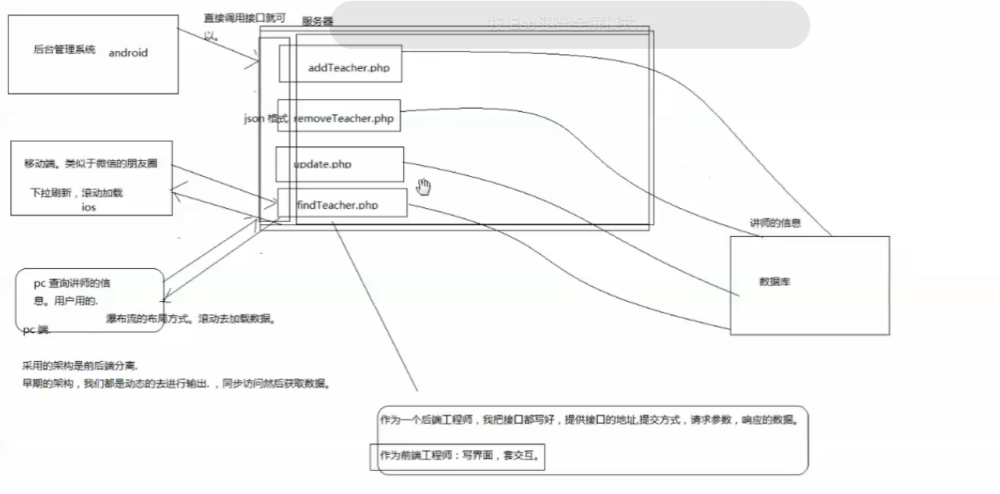


# 2018-06-28 jquery 模板引擎


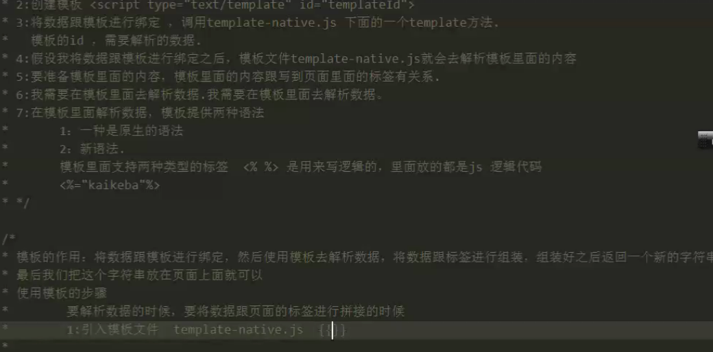


+ ajax 获取数据只能用事件委派

  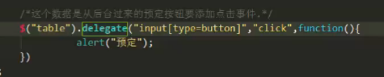

  ```
  不同源 跨域
  ```

  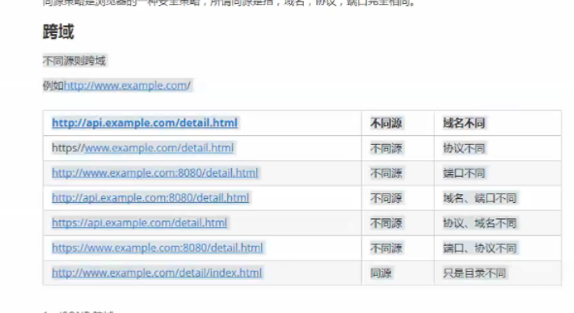


​	作业 请求 360 搜索接口的数据 通过script 标签 so.com

 + 流程图 xmind www.draw.io  mxgraph.js
 +  axure需求原型
 + 挂号平台  身份证 卖给黄牛
 + 区块链 dapp
 + 以太坊 solidity


# 2018-06-25 php xml json

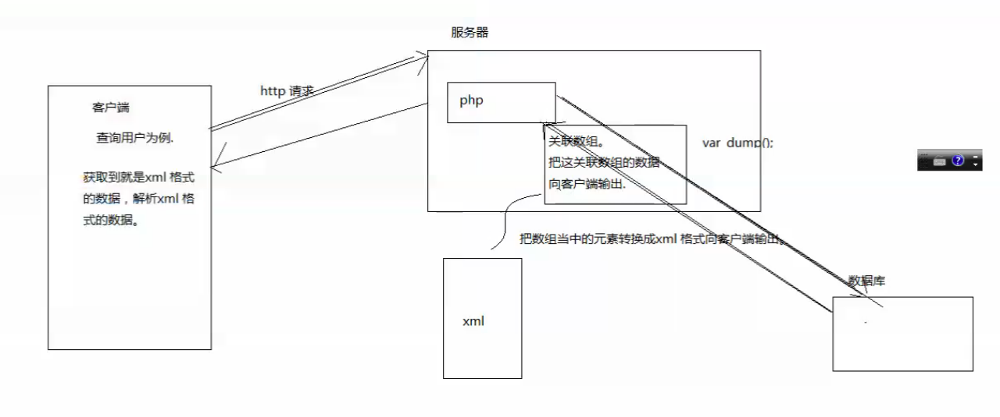

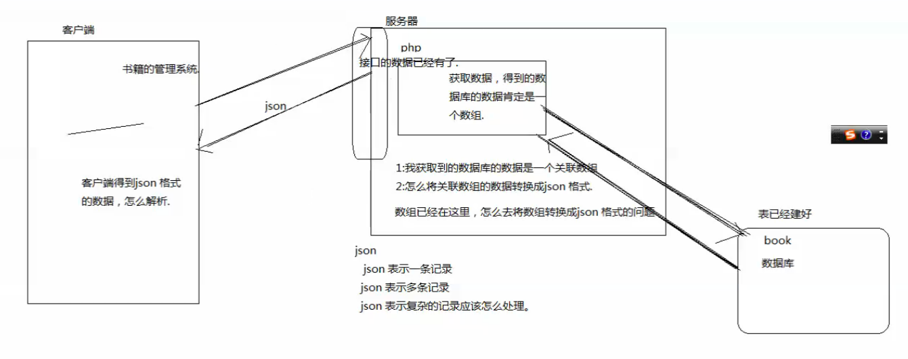


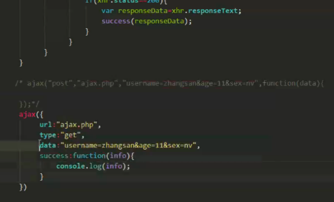


# 2018-06-23 session 

## php_session

```
$username=''

$_SESSION['username']
session_start();
echo $_SESSION['username']

```


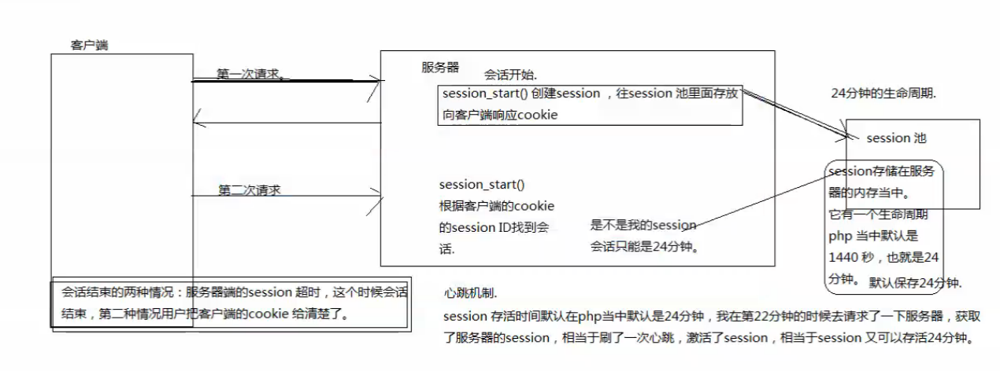


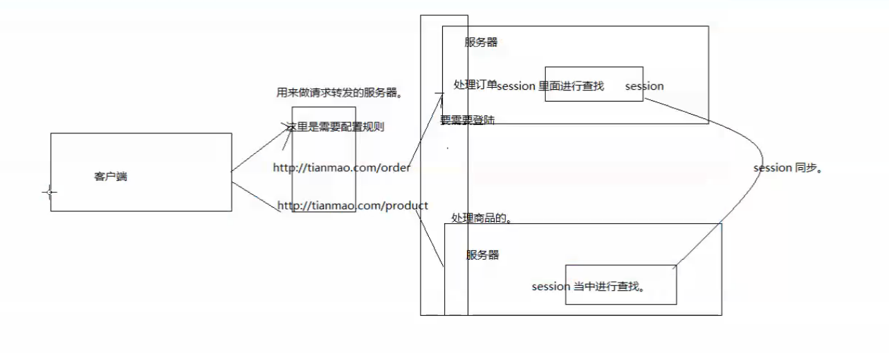

### 请求转发

+ cookie 存储在客户端 ，服务器 

+ sessionStroage   客户端 本地存储 生命周期 关了阅览器就没了

+ localStroage  客户端 本地存储    关了不会  上一次播放时间

+ seeion   存储在服务器 以来cookie

+ 老师有个困惑？企业内有一个统一认证中心， 我的服务器判断session中是否包含用户信息，没有的话，我的服务器通过302跳转到认证服务器，后认证服务器再跳转到我的服务器，回来的请求为什么我的服务器可以直接获取到认证的用户名 身份信息

  

  

### session 案例

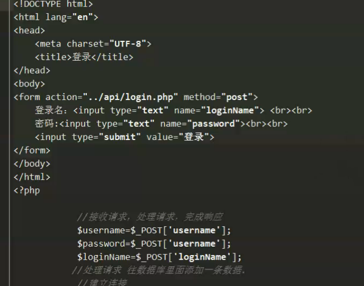


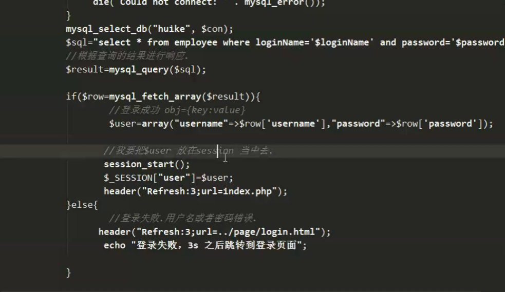

登录验证

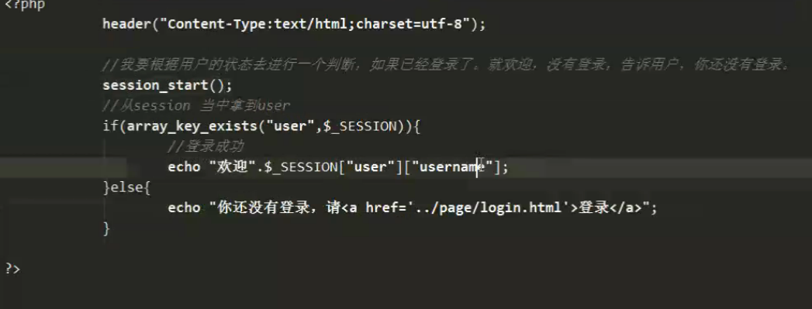

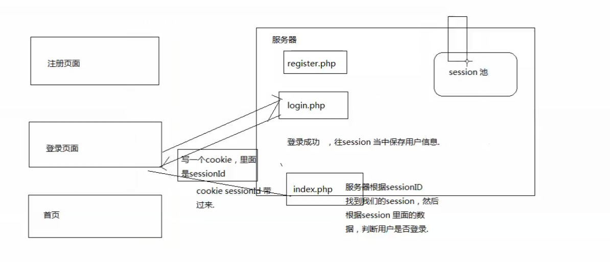


### ajax

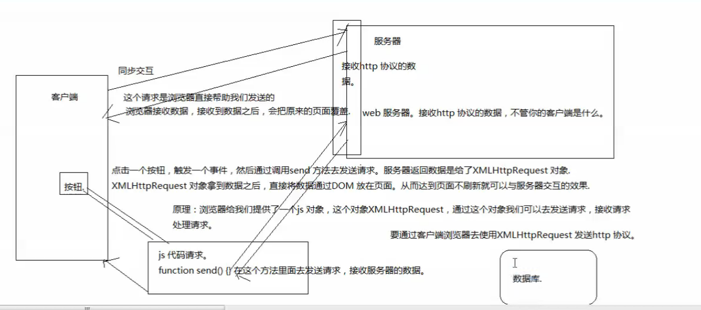

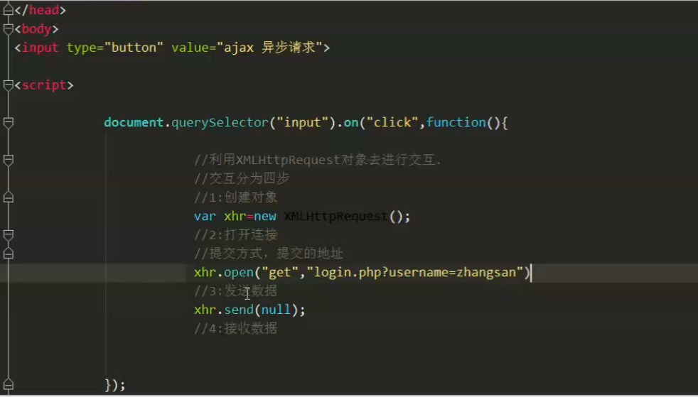

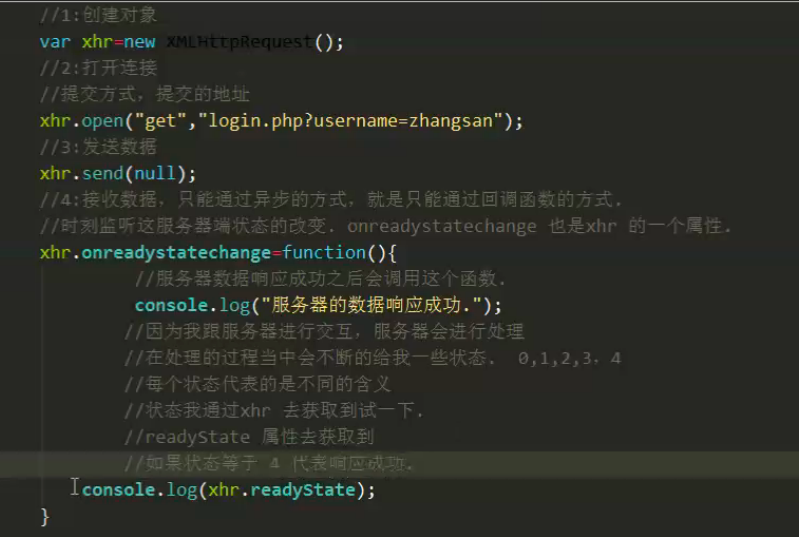

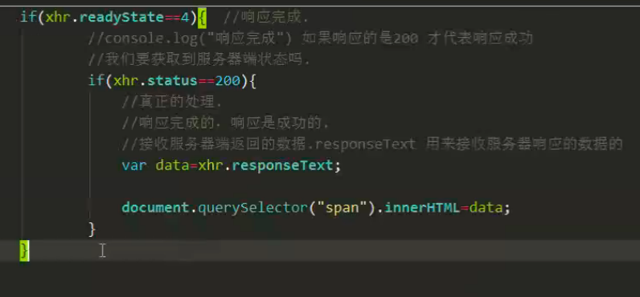

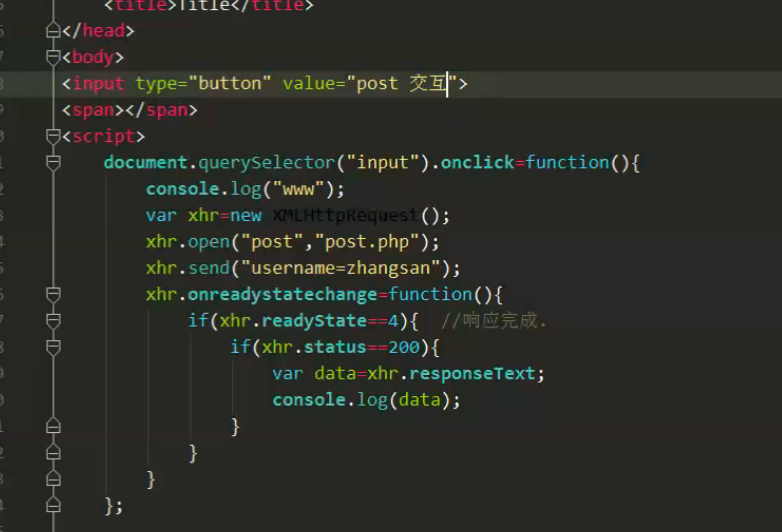


#####post 需要提交特殊的请求头

content-type application /x-www

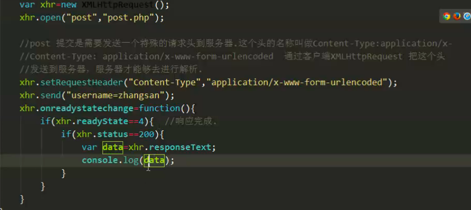


# Begin


## 获取元素

- 获取一个
- 获取全部元素
- 操作类样式 添加 移除 切换

## data- 自定义属性
懒加载 使用？？？
自定义属性  和 绑定id 对应
3点 如何获取 如何设置 

## 文件读取 api
- input file
  - one change 事件
     input.onchange=function(){
		for(){
		}
	}
     读取文件加载文件 onload 异步事件

#获取网络状态
- window.navigator.ononline
- ononline
- onoffline 事件 触发条件

#获取地理定位
- window.navigator.geolocation 经纬度 只能获取一次
- 实时获取位置消息

## 本地存储
- local  永久 20M  页面共享
- session 当前浏览器有效 
- window.localstorage.setitem get remove clean

## 操作多媒体  作业
- Dom 参考
- 完成一个在线播放器 网页云音乐 播放 下载 快进 跳播功能时间对应

## canvas
- 统计图 
- 小游戏  数据处理 图像处理
- 1.落笔坐标点 2.连线 3.描边 stroke()
- stroke()  多个 会重绘 描边 
- fill 填充 
- 非零环绕原则 正时针绘制 逆时针绘制 方向相反 射线 相交越少越好
  - 闭合 而且方向相反 点 射线 相交 +1 -1 为0 进行填充 顺逆时针
- biginpath（） 开启新图层  ctx.beginPath
- linewidth 线宽
- 虚线 ctx.setLineDash（【实线，空白，实线，空白】）
- 绘制动画 
  - rect 矩形
  - content.clearRect 清除

--作业：
	1. 从200,100的位置绘制宽为200高为150的矩形
        2. 准备一个600*400的画布，三等分这个画布，分别绘制正方形。直角三角形，梯形
- 线性渐变
- 绘制文本 填充文本 描边文本
- 绘制图片 content.drawImage   添加onload 事件后再开始绘制
	- 截图 绘制到哪
	- 不失真 宽高比
- 弧度 content.arc  绘制o度角 3点 角度为起点 往下6点90度为整网上为负 
	- 弧度制  math.pi*3 度  cos math.cos()*100
- 平移 ctx.translate
- 旋转 

## typora
#markdown
	- https://www.zybuluo.com/mdeditor


# 20180529 js 构造函数
function fn(name){
	this.name = name
}
var _n = new fn('小明');

## 构造函数方式2  重点jQuery 核心 原型
属性查找规则
1、变量声明了未赋值才是undefined 2、属性不存在也是undefined

上下文调用方式   最强大
call apply bind
function f1(){
	console.log(this)
}

只有对象才有原型
//第一个参数决定 this的值
f1.call([1,2,3])

bind 延迟执行  call apply 执行过程中绑定了 this值
动画 canvas 延迟函数 
setTimeout(function(){
	console.log(this)	
},50)
call、apply是立刻执行了这个函数，并且执行过程中绑定了this的值
bind并没有立刻执行这个函数，而是创建了一个新函数，新函数绑定了this的值
课外作业 5.29  思考bind 如何实现  如何解决浏览器的兼容问题


# es6
> 模板字符串
- var s1 = `111`
- 解决痛点  字符串拼接
- var s1 = `hello ${name}`
```
	var a = `<div>
			<span></span>
		 </div>`
```
- app 开发 react native？weex？
> 解构赋值
```
	获取对象
	var obj = {name:'aa',age:18}
	let { name,age } = obj;  //obj.name 创建了两个变量
```
- 减少全局变量污染?
- 有什么作用  可以节省一二写字符
```
	//使用结构赋值
	function fn(option){
		//option.width
	}
	fn({
		width:100,
		height:100,
		age:50
	})

	//接受对象自变量  局部变量
	function fn_2({ width,height,age}){
		console.log(width,height,age)
	}

```
- 其他用法
```
	var { name:obj2Name } = obj  //创建新变量 obj2Name
```
- 属性的简写
```
        var a = 3 ; var b = {a} ; console.log(b); // {a:3}
	var c = 4
	var d = {a,c}
        {a} === {a: a}
```

> rest 参数
```
	function fn(){
		//arguments 函数内部局部变量  调用函数传递的是实参数
		console.log(arguments.length)
		//第一个实参
		console.log(arguments[0])
		for(i in arguments){
			console.log(arguments[i])
		}
	}
	fn(1,2,3,4,5)
```
- es6 箭头函数内部不能使用arguments
		- rest 参数弥补这个问题
```
	// ...args rest参数的使用方式
	//产生了一个变量，是数组，包含所有实参
	function fn(...args){
		//验证数组
		console.log(args instanceof Array)
		console.log(Object.prototype.toString.call(args))  //"[object Array]"
		console.log(Array.isArray(args)) //es5 方法
		console.log(args)
	}
	fn(1,2,3)
```
+ typeof
	- typeof 智能判断 数字 字符 布尔 undefined 函数
+ Object.prototype.toString.call()
	- 5 '[object NUmber]'
	- [object String]
	- [object Boolean]
	- [object Null]
	- [object Undefined]
	- [object Array]
	- [object Function]
	- [object Date]
	- [object RegExp]
> 箭头函数
- 箭头函数就是为了绑定匿名函数
```
	//无参匿名函数
	div.onclick=function(){}
	div.onclick=()=>{}
	//有参数
	var fn=name=>{console.log(name)}
	var fn=(name)=>{}
```
> 匿名函数
```
	var status = [1,2,3]
	status.forEach(function(value,index){
	})
	status.forEach(value=>{
	})
```
+ 阮一峰
+ 箭头函数和匿名函数有哪些不同？  重点
	- 函数 作用域
	- 箭头函数不能作为构造函数
	- 不可以使用arguments对象
	- 不可以使用yield命令
	- Generator函数经常用async替代
```
	var p={
		age:18,
		run:()=>{
			setTimeout(()=>{
			 //默认指向this windows方法
				console.log(this)
			},1000)
			//外层函数 作用于是全局作用域
		}
		say:function(){
			setTimeout(()=>{
			 	//默认指向p对象 
				console.log(this)
			},1000)
		}
		//es6为了解决这种问题

		//es6对象方法简写  推荐使用的匿名函数书写方式
		say(){
			console.lg(this)
		}
	}
```

+ 实际中用ES6的话,兼容性上是不是不太好? 用bable插件

> bable 插件 https://www.babeljs.cn
+ vue 脚手架 vue-cli内置了babel，如果需要可以修改兼容版本

## vscode 好看简洁 强大 sublime webstorm
+ https://marketplace.visualstudio.com/items?itemName=ruakr.ftp-kr
+ https://www.javascriptcn.com/read-7177.html

## mnd 开发社区
+ https://developer.mozilla.org/zh-CN/


# 20180531 JS高级
## bind方法实现
+ 1、bind方法放在函数的原型中
```
	Function.prototype._bind = function(target){
		return function(){}  //不可以
		//利用闭包 创建内部函数  返回新函数
		return (function(){
			//执行fn里面的逻辑
			this.call(target);
		})()
	}
	function fn(
		console.log(this)
	){}
	fn.bind({age:18})
	var _f3 = fn.bind({age:11})
	_f3()
```

##对象的扩展
```
	Object.assign 对象的浅拷贝
	var source={age:18,height:170}
	//克隆新对象
	var target={};
	var newObj = Oject.assign({},source)
```


## 回调地狱 Permise
```
	function f1(){
		setTimeout(()=>{
			console.log(1)
		},1000)
	}
	function f2(){ return new Permise(resolve=>{
		//告诉外界我已经执行完了
		resolve()
		})
	}
	f1().then(res=>{
		return f2();
	}).then(res=>{
		return f3();
	})
```
+ promise es6  sync es8
+ rxjs
+ Promise 错误处理方式
```
	function getPromise(fn){
		return new Promise(resove=>{
			$.get('/apie',function(res){
				//res
			})

		})
	}
	getPromise().then(res=>{
		//res 服务器中获取数据
	})

	function getPromise(fn){
		return new Promise(resove=>{
			$.ajax({
				url:'/api',
				success(res){
					resolve(res);  //成功
				},
				error(res){
					reject(resError); //失败处理
				}
			})

		})
	}

	getPromise().then(res=>{
	
	},resError=>{
		console.log(resError)
	})
	//第一个参数成功回调   第二个参数 失败回调


	第二种错误处理方式
	getPromise.then(res=>{
		//成功
	}).catch(resError=>{
		//失败
	})

	//区别 ，推荐第二种
	//第二种 强大  不仅仅可以捕获到 reject 传递的参数
	//还可以捕获到 成功的毁掉中发生的错误

```
+ catch
```
	function f1(name){
		return new Promise((resolve,reject)=>{
			setTimeout(()=>{
				if(name=='a'){
					resolve('成功')
				}else{
					reject('失败')
				}
			})
		})
	}
	f1('a').then(res=>{console.log(11111)})
	f1('a').then(res=>{
		console.log(11111)
		var a=5;
		a();  //代码发生了错误
	}).catch(res=>{
		console.log(res);
		//成功中失败的代码也能捕获
		
	})
```
## async
```
	(async function(){
		//异步操作 函数f1()
		await f1();
		console.log('第一步')
		await f1();
		console.log('第二步')
	})()


	function q(){
	    return new Promise((resolve)=>{
		setTimout(()=>{
			resolve("hi")	;
		},1000)
	    })
	}
	(async function(){
		const res = await q();
		let res = await q();
		const res1 = await q();
	})()


	var p = {
		say:async ()=>{
			await q();
		},
		run:async function(){
			await q();
		}
	}

    try{
	(async ()=>{
		let res = await p.say();
		console.log(res)
		await p.run();
	})()
    }catch(e){	
	console.log(e)
    }

```
+ async 处理返回值
	- let 
	- const
```
	async function get(){
		var let res = await  timer()
	}
	get()
```
+axios 也可以异步操作


## class 类语法  原型继承的根
```
	function a(name,age){
		this.name = name;
		this.age = age;
	}
	one = new a('hao',12)
	//类的样式
	class p{
		//构造方法
		constructor(name,age){
			this.name = name
			this.age = age
		}
	}
	var s = new p('hao',18)
```
+ class 类的方法
```
	function p(){
	}
	p.prototype.run=()=>{
		console.log('run')
	}
	class s{
		constructor(age){
			this.age = age
		}
		run(){
			console.log(`run class ${this.age}`)  //模板字符串
		}
		static down(){
			console.log('class 类的静态方法')
		}
	}
	var s1 = new s(18);
```
+ 类的静态方法 static down(){}
	- p.down()
+ 类的静态属性  通过自身属性访问的this static down(){}
	- p.age
+ 类的继承  (原型继承）
```
		class p{
			constructor(name){
				this.name = name
			}
		}
		class a extends p{
			constructor(){
				super(name);  //调用父类构造方法
				//通过super 继承了name属性
				this.age = age //自身构造属性
			}
		}
```

## model 模块
## 框架封装

#20180603
#sources 断点 调试行
```
function f1(){
	console.log(age)
	var age=18;
	console.log(age)
}
var length=100;
f1();
```
+ 变量作用域取决于作用域所处的范围 
	- 页面加载完成

# mpvue 小程序项目？？？？
# 项目实战 封装库
+ 不依赖第三方库
+ 隔绝  只有$ jQuery

```
	(function(){
		function jQuery(){
		}
	})(window)
	//window.$ = window.jQuery = jQuery;
	//相当于
	window.jQuery = jQuery;
	window.$ = jQuery;
```

+ 获取div属性
```
	(function(){
		function jQuery(){
		}
	})(window)
	//window.$ = window.jQuery = jQuery;
	//相当于
	window.jQuery = jQuery;
	window.$ = jQuery;
```
#$ css 封装实现
#$.extend   拷贝继承 和 属性继承
+ obj1  obj2 的属性一一赋值obj3
+ 使用es6对象扩展运算符，改写extend方法

# 20180610
+ 正则表达式
```
	字符集合
	[] 匹配一个字符  /[1a2b3]/;
	var reg1 = /[123][abcd]/  匹配两组字符
	reg1.text('2a');

	[^]
	var reg1 = /[^123]/  字符中不只包含 1 、2 、3
	reg1.text("a");
```

### 作业
```
	识别 $("#aa")  $(".aa")  $("span")
	"123asdfafeij1232".replace(/\d/g,"")
	只替换字符串的前后空格
	" 123asdf  afe ij1  232 ".replace(/\s/g,"")
```
# 模块化 mvvm 框架  
/^\.\w/.test('.a_c')
我的电脑  22:05:12
/^\#\w/.test('#abc')
我的电脑  22:21:46
/^\w/.test('abc')


## 作业1
### jquery：选择器引擎：Sizzle大量的使用了正则表达式
```js
    $("#abc")   //id
    $(".abc")   //类
    $("span")   //标签
    /^#/.test('#abc')
    /^\./.test('.abc')
    /^\w/.test('abc')
```

## 作业2：写一个正则表达式，用于替换一个字符串的前后空格
+ 比如："   asdffsf  asdfasfsd asfas a "替换为"asdffsf  asdfasfsd asfas a"

"    asdffsf  asdfasfsd asfas a ".replace(/^\s{1,}([\s\S]*?)\s{1,}$/,'$1')

### require 解决循环依赖问题


# php
## lamp 
+ https://blog.csdn.net/maia007/article/details/52133789?locationNum=9&fps=1
```
sudo apachectl start
/etc/apache2/http.conf
LoadModule php5_module libexec/aache2/libphp5.so
sudo apachect1 restart
php -v
/Library/WebServer/Documents
<?php phpinfo(); ?>

```

# php
```
/Users/chenhaohao/git/learn/web
http://127.0.0.1/web%E5%85%A8%E6%A0%88/20180616_php/day_01/code/01.php
http://127.0.0.1/web全栈/20180616_php/day_01/code

mac lamp 
https://blog.csdn.net/maia007/article/details/52133789?locationNum=9&fps=1
配置mysql mac mysql dmg
vi /etc/paths  添加环境变量
sudo mysqladmin  -u root -p password

```
+ https://blog.csdn.net/li396864285/article/details/51939423
```
没有后端基础

张亚军
我UI，前端懂一点，
```


# 自考 20180715

```
1 先选好要考的课程，建议难易搭配，如果考4门，建议2难2易。所谓难的就是自己不擅长的，如果分不清难易，一般学分高的课程较难一些。容易的就是擅长的，比如我对哲学，语文，政治类的公共课都比较擅长，对统计，计算题多的课程不擅长。
2 提前准备，一般考试前四个月就要开始动起来了，考4门课，每门课至少要给1个月的复习时间才够，10月考试，现在就要看书了，否则如果你不是天才，时间真的来不及，自考是一个积累的过程。我们的目的是一次过4门，不花上大量时间是不可能成功的，别懒惰了，现在就去拿书吧。
3 最最重要的，做题目，别浪费时间在教材上了，教材最多通读一遍，其实我考到现在，教材基本上没看过，那么多字，看一遍也要好几天，何况大多数内容看完就忘。所以还是拿起辅导书题库做题目吧，题目一定要做多遍，至少10遍以上，做到什么程度呢，这样说吧，看到题目前几个字，马上就能说出答案。如果到了这个水平了，恭喜你，你一定可以过了。前面说了，平均一门课的题目做一个月下来，基本没什么问题。
4 其他没什么了，就是要有信心，要经常告诉自己，没什么难的，别人能考过，我也能考过，考试的时候调整好心态，做不出题目别慌张，100分的卷子只要考60分就合格了，丢几分十来分无所谓的，真的没什么难的


```

| 公共基础课程 | 1                                                            | 03706                                    | 思想道德修养与法律基础 | 2                     | 2018-10-20 9:00~11:30  |      |
| ------------ | ------------------------------------------------------------ | ---------------------------------------- | ---------------------- | --------------------- | ---------------------- | ---- |
| 2            | 12656                                                        | 毛泽东思想和中国特色社会主义理论体系概论 | 4                      | 2018-10-21 9:00~11:30 |                        |      |
| 3            | 00018                                                        | 计算机应用基础                           | 2                      | --                    |                        |      |
| 4            | 00019                                                        | 计算机应用基础(实)                       | 2                      | 以主考院校为准        |                        |      |
| 核心课程     | 5                                                            | 00312                                    | 政治学概论             | 6                     | 2018-10-21 14:30~17:00 |      |
| 6            | 00107                                                        | 现代管理学                               | 6                      | --                    |                        |      |
| 7            | 03350                                                        | 社会研究方法                             | 4                      | --                    |                        |      |
| 8            | 00277                                                        | 行政管理学                               | 6                      | --                    |                        |      |
| 9            | 00147                                                        | 人力资源管理(一)                         | 6                      | 2018-10-20 9:00~11:30 |                        |      |
| 10           | 00182                                                        | 公共关系学                               | 4                      | 2018-10-21 9:00~11:30 |                        |      |
| 11           | 10237                                                        | 行政管理理论与实践综合作业(实)           | 5                      | 以主考院校为准        |                        |      |
| 选修课程     | 12 13 14 15                                                  | 04729                                    | 大学语文               | 4                     | 2018-10-21 9:00~11:30  |      |
| 00040        | 法学概论                                                     | 6                                        | --                     |                       |                        |      |
| 00292        | 市政学                                                       | 6                                        | --                     |                       |                        |      |
| 00341        | 公文写作与处理                                               | 6                                        | 2018-10-20 14:30~17:00 |                       |                        |      |
| 说明         | 说明:1.“03707毛泽东思想、邓小平理论和“三个代表”重要思想概论”可顶替“12656毛泽东思想和中国特色社会主义理论体系概论”课程。 2.00018/00019计算机应用基础课程须参加全国计算机等级一级或以上考试并取得等级证书。 3.选修课程，可在推荐选修课程中选考，也可在我省现行开考所有专科专业中选考与本专业核心课程不同的课程，课程门数不少于4门，学分不低于22学分。不得跨专业选修实践课。 |                                          |                        |                       |                        |      |

