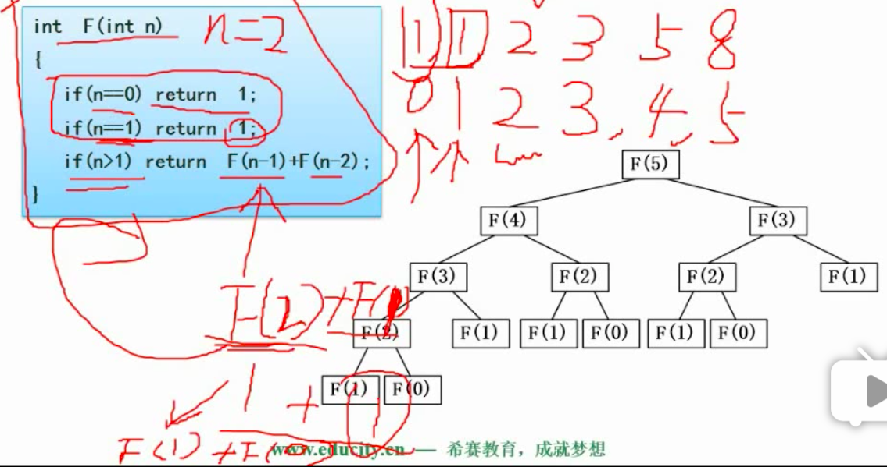

# 软件设计师


### 


# 下午题


## 数据流图（数据库）

数据流图 dfd： 需求分析阶段工具，每次都会考到 第一题 15分，

+ 1、补充外部实体，补充数据存储，补充数据流
+ 2、父图、子图查找有什么样的缺陷，存在什么样的问题

####1、数据流图基本概念

涉及哪些图形符号，所代表的含义


数据的流向 ， 用户信息 包含什么？？ 如何解释包含哪些信息


用户加工 圆角矩形 原型 函数 操作

数据存储 是以表的颗粒度来存储的

系统之外的人员组织，操作系统的人，外部实体 矩形表示

> 以下哪些元素不属于数据流图的基本元素？？？？
>
> ER图和数据流图做混淆处理？？？ er图有实体 和练习   ，数据流图里没有联系 用菱形表示 加工

**数据流图分层**

最上面表示开发的系统

方框表示外部实体，顶层能够表达的信息有限，知识把表达的信息浓缩为一个节点，和外部有哪些交互

但是这个系统分哪些模块，模块之间有哪些数据的交换看不清楚，外部实体没有变化，变化的是内部

内部进行了细化，一个节点拆分为几个节点，实际上就是系统处理的几个处理的逻辑代码单元

分层是自顶层向下，逐层分解，顶层设计的重要性   **顶层设计和解构化的开发方法**

数据流图是结构化开发方法的最主流工具


父图与子图要保持平衡，何为平衡，如何保持平衡， -》 涉及到平衡原则


####2、数据字典

数据流图里起到解释


#### 3、数据平衡原则

存在2个原则，结题时非常重要

#####1、父图与子图之间的平衡

> ？？？解题的关键  根据顶层 补全0层所缺失的数据流
>
> ？？？检查 箭头 所指方向    缺失了处理后的操作结果


#####2、子图内平衡

什么意思，对于正常的而加工，即有输入，也要有输出

只有输入没有输出为黑洞，只有输出没有输入为奇迹


> ？？？？找到 缺失的输入输出
>
> ？？？？缺了哪一个数据流
>
> ？？？？补充 起点是什么 终点是什么  数据流名称是什么

#### 数据流图答题技巧

##### 1、详细分析说明

加工出来的用户信息是数据流

##### 2、利用数据平衡原则


#### 数据流图答题解析


## 数据解构及算法应用

### 分治法

 + 1、分解后可以很容易的解决
 + 2、若干小的相同问题
 + 3、分解的子问题合并后可以解决最终的问题
 + 4、子问题相互独立
 + **递归技术**  运行过程中调用自己
    + 求数列之和  子树之和
    + 
    + **二分法** 
       + 查找  Fun（数组  开始位置  结束位置 要查找的值）
       + 查找判断是否大于中间数值 修改开始 结束位置继续查找
       + 
       + 


### 回溯法

 + 深度优先的搜索方法

 + 按最优条件进行搜索

 + 如果非最优 或者无法实现 则退会重新开始

 + 

 + #### 如果 遇到问题 需要逐步试探下去，走到某一步 需要回退 则使用该方法

 + 


​	


### 贪心法

+ 贪多 贪好
+ 定义一个原则 ，每一步都会让我选择最好的
+ 可以得到满意的解，不一定是最优解
+ 背包问题
+ 


### 动态规划法

+ 四个算法中逻辑最复杂

+ 每一步决策可能得到的局部解

+ 舍弃 肯定不能得到最优解的选项，筛选

+ 已每一步最优解保证全局最优解

+ #### 肯定会查表的方法  

  + 与分治法显著的特征


### 例题


最先适宜5 和 最优适宜 4


不能得到最优解， 最优 是贪心策略法，从整体未必最优，知识局部最优

最优适宜 采用的 贪心法

最先适宜  也是贪心法

时间复杂度

​	单常量O(1)

​	循环for  <n   时间复杂度是O(n)

​	双循环嵌套都和n有关  时间复杂度是O(n2平方)

​	整个时间复杂度，已最高的为标准


# uml

+ > 
  >
  > 用例图

  + 案例分析  题干项目详细描述 参与者 某些用例填空
  + 两个用例之间的关系     
    + 包含关系
    + 扩展关系
    + 泛化关系

  ```
  图书管理员  ——》 新增书籍    
  		  ——》 查询书籍     
  		  			《- - -   修改书籍	每次查询有的时候会需要修改
  		  			 《extend》 扩展关系
  		  ——》 登记外借信息
  		  			----》用户登录 用例必须
  		  			《include》  包含关系
  		  			
  		  			
  ```

  

+ > 
  >
  > 类图与对象图

  + **填类名**， 方法名、属性名
  + **填多重度**
    +  1	集合中的对象1对1  
    +  0..*  1 对 0 或多
    +  \*   1对 0 或 多
    +  1..*  1对多
  + 关系线
    + 箭头 表示关联关系  双箭头表示相互关联比如夫妻
    + 三角线  表示泛化关系 表示继承 表示一般和特殊  子类包含父类所有特征和行为
    + 菱形线 表示聚合  整体和部分的关系 可以离开整体而单独存在  车和 车轮
  + 填关系

  

  

+ > 
  >
  > 顺序图

  + **对象** 填对象
  + 生命线   **整体执行顺序 从上往下    有箭头的地方表示对象相互交互 发送消息**
    + 处理数据时间顺序如何 按顺序
  + **消息** 考  处理的流程 问 6号消息是干嘛的

  

  

+ > 
  >
  > 活动图 

  + 解构形图  能够表示整个程序的出路流程和分支状态
  + 菱形表示分支 真假
  + 粗横线表示产生多少并行线程
    + 产生两大分支后合并了

  

  + 带甬道的活动图 哪个活动归属谁的 有他的责任人


+ > 状态图

  + 归为动态图
  + On off  表示状态  箭头表示事件 触发状态
  + 描述 表示多种状态变迁  问状态
  + 状态变迁的条件 ：触发事件
    + 总共有哪几种状态
    + 一种状态到另一种状态需要哪些条件
    + 从这种状态回到先前的装态又需要哪些条件


+ 通信图

  + 又称协作图 顺序图的另一种表达方式
  + 对象就是每一个节点
  + 对象的交互通过箭头表示  
  + 消息在箭头胖标注
  + 与书序图相比 时间序列表示的没有呢么清晰

  

+ 构建图

+ > 案例

  + 描述 1、2、3

    

    

    判断**多重度**的时候是站在 ，该点位置

    	

  最短的事件路径  按任意键-》选择歌曲—》播放 

  