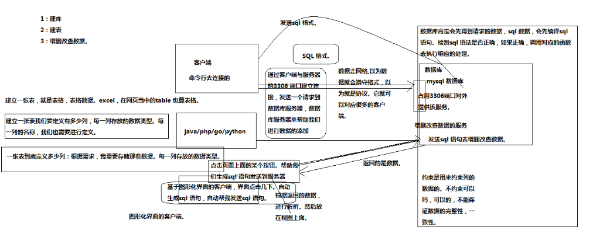
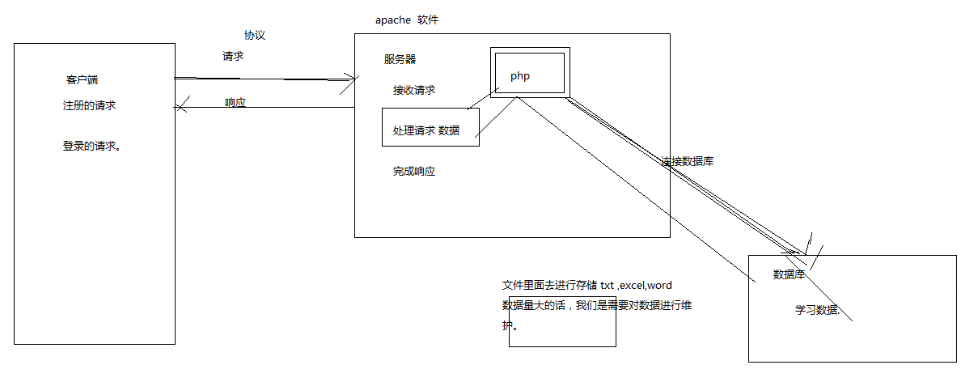
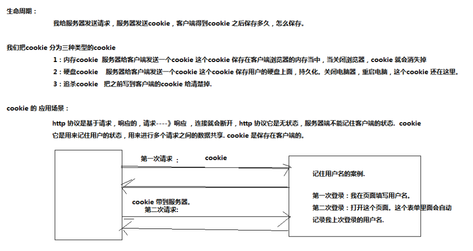

## HTTP服务&AJAX编程

- 文件上传的小案例(客户端怎么处理)(服务端怎么接收数据)

- http 协议的基本概念(客户端与服务器端进行交互的一种数据格式)

- http 请求的数据格式以及响应的数据格式分析(http 协议就是基于请求响应的协议.)

- get  请求以 post 请求的区别

- 常见的请求头以及响应头的作用

  (检测客户端浏览器的版本)

  （浏览器客户端过几秒钟之后自动跳转）

- 常见的状态码

  200  ok

   403  没有权限访问

   404  请求的资源没有找到 

  304  后端的文件的没有任何的改变 

  302  重定向 

  500  服务器内部错误.

- 数据库的概念

- 数据库的安装 wamp 

- 数据库的存储方式  

  ## 1.1 MySQL的使用

  ```
  一个数据库服务器中可以有多个数据库  
   一个数据库当中可以有多张表用来存储数据 
   一个表中可以用来存储多条记录 
  ```

  ### 启动 和 停止MySQL服务

  1. 通过Windows服务管理器启动MySQL服务

  通过Windows的运行，输入services.msc找到MySQL服务

  1. 通过DOS命令启动MySQL服务

     et stop mysql	停止MySQL服务

     et start mysql	开启MySQL服务

  ### 登录MySQL数据库

  **使用相关命令登录**

  打开命令台：

  mysql -h localhost -P 3306 -u root -p

  -h：主机名

  -P：端口

  -u：用户名

  -p：密码

  这种方式一般用来连接远程数据库服务器

  mysql默认连接localhost和3306，所以可以省略-h和-P

  mysql -u root -p

  这种方式一般用来连接本机，可以省略-h和-P，默认就是localhost和3306

  #### 创建数据库

  **CREATE** DATABASE [IF **NOT EXISTS**] db_name;

  创建   数据库	数据库名;

  注意：一定要在语句的末尾加分号

  注意：中括号都表示可选的意思，不是让你把中括号也写进入，否则mysql根本不识别。

  #### 查看数据库

  show database;

  #### 删除数据库

  **DROP** DATABASE [IF **EXISTS**] db_name;

  #### 选择数据库

  USE db_name;

  

  ### 数据库表的概念

  ​       我们的数据是面向表存储的，数据库表格式用来存储数据的，这个我们现实当中的表一样，我们首先需要定义表当中有多少列，然后我们可以往表当中添加一条一条的记录。我们在定义一张表的列时，我们需要先根据需求对这张表进行设计，设计一般主要是设计表当中有哪些列，这一列对应的名称是什么，它所存放的数据类型是什么，这个我们也称为表结构的设计。所以在学习表的设计之前，我们需要学习表的一些相关知识.

  ##### 数据类型

  数据类型是用来约束表当中每一列存放的数据类型。这样做的目的是为了

  ##### 整数类型

  

  ##### 日期和时间

  

  ##### 字符串和二进制

  

  

  ### 数据库表的基本操作

  #### 创建数据库表

  ```
  CREATE TABLE table_name
  (
      field1  datatype,
      field2  datatype,
      field3  datatype,
  )
  ```

  #### 查看数据表

  查看当前数据库中的所有表。

  ```
  show tables;
  ```

  查看表结构

  ```
  desc table_name;
  ```

  查看建表语句

  ```
  show create table table_name;
  ```

  #### 删除数据表

  ```
  DROP TABLE table_name;
  ```

  ### 表的约束

  为了防止数据表中插入错误的数据，在MySQL中，定义了一些维护数据库完整性的规则，即表的约束。

  约束是用来约束每一列的整个数据的，保证这个数据的完整性。

  | 约束条件    | 说明                             |
  | ----------- | -------------------------------- |
  | PRIMARY KEY | 主键约束，用于唯一标识对应的记录 |
  | FOREIGN KEY | 外键约束                         |
  | NOT NULL    | 非空约束                         |
  | UNIQUE      | 唯一性约束                       |
  | DEFAULT     | 默认值约束，用于设置字段的默认值 |

  表的约束条件都是针对表中字段进行限制，从而保证数据表中数据的正确性和唯一性。

  ### 数据处理

  #### 增加数据

  ```
  INSERT INTO table_name VALUES(value1,value2,value3...);
  
  INSERT INTO employee(username,PASSWORD,loginName) VALUES('小旋风','111111','xiaoxuanfeng@kaikeba.com');
  ```

  #### 修改数据

  ```
  UPDATE table_name     SET col_name1=expr1 , col_name2=expr2  where condition;
  UPDATE employee SET username='caidaguanren' WHERE id=2;
  ```

  #### 删除数据

  ```
  delete from** table_name  [WHERE where_definition];
  DELETE FROM employee WHERE id =1;
  ```

  #### 查询数据

  ```
  SELECT [DISTINCT] *|{colum1, colum2, colum3...} FROM table_name;
  SELECT指定查询哪些列的数据
  column指定列名
  * 号表示查询所有列
  FROM 指定查询哪种表
  DISTINCT 可选，指查询结果时，是否去除重复数据
  SELECT COUNT(*) FROM employee; 统计某张表里面的数据的数量
  SELECT * FROM employee
  SELECT * FROM employee  where columnName= value;
  
  ```

  ### SQLYong 的介绍

  它是一个基于图形化界面的mysql 客户端软件，通过此软件，我们可以通过图形化界面的方式去连接数据库，

  创建表，增删改查数据。整个操作都是基于图形化界面的，避免我们编写大量的sql 语句，提升我们的开发效率。

  

  ## php 连接mysql 数据库

  ### 前端部分

  ### php 部分

  #### 注册 往数据库里面添加一条记录

  ```
  /*
  响应的数据
  */
  header('Content-Type:text/json;charset=utf-8');
  /*
  连接数据库
  账号，密码
  */
  $con = mysql_connect("127.0.0.1","root","");
  if (!$con){
  	die('Could not connect: ' . mysql_error());
  }
  //连接那个数据
  mysql_select_db("kaikeba", $con);
   //sql 语句
  //把客户端获取到的值，往数据库里面添加
  $sql="INSERT INTO teacher (username, telephone, age,t_desc); VALUES('$_POST[username]','$_POST[telephone]','$_POST[age]','$_POST[desc]','$_POST[lifephoto]')";
  //通过连接发送sql语句;     
  if (!mysql_query($sql,$con)){
   	die('Error: ' . mysql_error());
  };
  //关闭跟数据库的连接
  mysql_close($con);
  ```

  #### 登录 (从数据库里面查询一条记录)

  ```
   //给客户端一个响应头，响应json 格式的数据.
   header('Content-Type:application/json;charset=utf-8');
  //连接数据库 得到连接
   $con = mysql_connect("127.0.0.1","root","");
   if (!$con){
     die('Could not connect: ' . mysql_error());
  }
  //连接那个数据库  pdj 数据
  mysql_select_db("pdj", $con);
  $result = mysql_query($sql);
  //定义了一个空数组.
  $list = array();
  $total = 0;
  //把数据库里面返回的结果$result 遍历出来
  //放在$list 空的数据里面.
  while($row = mysql_fetch_array($result)){
  $item = array(
      'id' => $row['id'],
      'username' => $row['username'],
      'telephone' => $row['telephone'],
      'age' => $row['age'],
      't_desc' => $row['t_desc'],
      'lifephoto' => $row['lifephoto'],
  );
  //往数组里面添加一条记录.
  array_push($list,$item);
  //总记录数
  $total = $row['total'];
  }
  echo "<a href=''>kaikeba</a>";
  mysql_close($con);
  ```

  #### 修改密码 (更改数据库的数据);

  ## cookie

  ### cookie 概念

  

  ​	什么是Cookies（“小甜饼”）呢？简单来说，Cookies就是服务器暂时存放在你的电脑里的资料（.txt格式的文本文件），好让服务器用来辨认你的计算机。当你在浏览网站的时候，Web服务器会先送一小小资料放在你的计算机上，Cookies 会把你在网站上所打的文字或是一些选择都记录下来。当下次你再访问同一个网站，Web服务器会先看看有没有它上次留下的Cookies资料，有的话，就会依据Cookie里的内容来判断使用者，送出特定的网页内容给你。 

  怎么去使用：

  服务端：怎么发送cookie (setcookie() 函数用于设置 cookie );

  ```
  setcookie("user", "Alex Porter", time()+3600); 服务端向客户端设置cookie
  ```

  客户端：怎么获取cookie

   var cookies=document.cookie;

  ###cookie 的生命周期

  

  ##### 内存cookie

  ```
  setcookie("user", "zhuwu");  如果不设置时间，默认就是内存cookie ，当浏览器关闭，客户端会把cookie 清空，整个周期在浏览器的内存当中。
  ```

  ##### 硬盘cookie

  ```
  header("Content-Type:text/html;charset=utf-8");
  //设置当前cookie 的时间为一天。
  setcookie("user", "zhuwu",time()+3600*24);
  echo "php cookie";
  ```

  ##### 追杀cookie

  ```
  把cookie 的value 设置为空，失效时间改成-1 这样即是追杀cookie，把客户端成cookie 清楚。
  setcookie("user", "",-1);
  ```

  ###具体作用:

  ​		http 协议是基于请求响应的协议，请求-->响应，连接断开。没有办法记录客户端的状态。也就没有办法对用户的行为进行跟踪，我们可以根据cookie 对用户进行状态的跟踪,。

  cookie流程：当第一次访问服务器，服务器可以向客户端发送cookie，可以往cookie 当中存入需要的数据。

  客户端如果接收到服务器端响应的cookie，会把cookie 自动保存起来。当客户端再次请求服务器的时候，

  浏览器会自动把客户端cookie 的数据发送到服务器。

  ## session

  ### session 概念

  session  代表的就是一次会话。会话在我们的现实过程当中有很多，

  比如我们拨打10086，在10086，当10086 接通时，代表我的会话开始，中间我可能发送多次动作交谈，直至挂断，会话结束。整个会话过程当中，我们可能会发送多次请求。由多次请求组成一次会话。

  那什么代表我们的网站会话嘞，我们可以这么理解，打开网站，访问我的网站时会话开始，在这个网站当中我可能发送多次请求，直至关闭浏览器会话结束。这整个过程当中我们可以理解成一次会话.

  http 协议是基于请求响应的，无状态的，一次会话当中包含多个请求，每个请求都是相互独立的，会话当中包含多个请求，我们需要在请求之间共享数据，所以这个时候，我们就需要使用到会话。

  ###session 的使用

  ​    我们可以在一个站点发送两次请求，我们知道每个请求都是独立的，他们是不能共享数据，这个时候我们使用session 会话，让两个请求之间可以共享数据。

  php 服务器端创建会话:

  ```
  session_start();  会话开始
  $_SESSION[]	 往改数组里面保存数据。	
  session 的 默认时间在php 里面是24 分钟。
  ```

  ###session 的原理

  

  ###session 的应用

  用户登录

  

  

  

  

  

  ​		

  ​	

  ​		

  

  

  

  

  

  

  

  

  