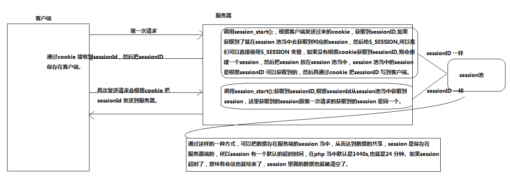
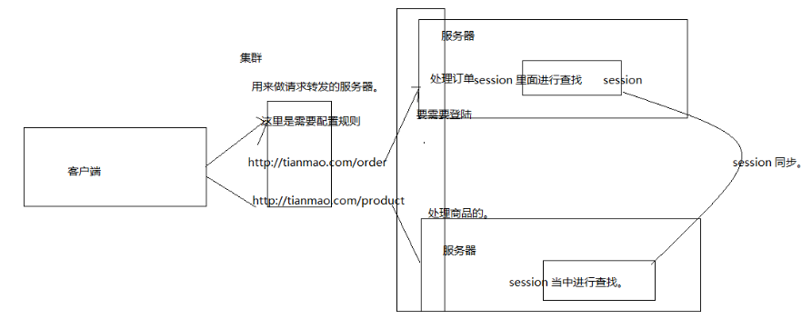
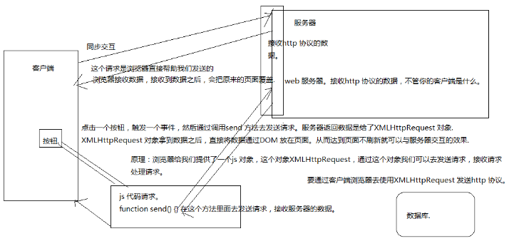

##HTTP服务&AJAX编程

###上次内容复习

- mysql 的存储方式

```
 一个数据库服务器中可以有多个数据库  
 一个数据库当中可以有多张表用来存储数据 
 一个表中可以用来存储多条记录 
```

- 数据库操作

```
创建数据库
CREATE DATABASE [IF **NOT EXISTS**] db_name;
查看数据库
show database;
删除数据库
DROP DATABASE [IF EXISTS] db_name;
选择数据库
USE db_name;
```

- 数据库表

  ```
  我们的数据是面向表存储的，数据库表格式用来存储数据的，这个我们现实当中的表一样，我们首先需要定义表当中有多少列，然后我们可以往表当中添加一条一条的记录。我们在定义一张表的列时，我们需要先根据需求对这张表进行设计，设计一般主要是设计表当中有哪些列，这一列对应的名称是什么，它所存放的数据类型是什么，这个我们也称为表结构的设计。所以在学习表的设计之前，我们需要学习表的一些相关知识.
  ```

  ```
  数据类型,整数类型,日期和时间,字符串和二进制
  ```

  ```
  数据库表的操作
  查看当前库下面所有的表
  show tables;
  查看表结构
  desc table_name;
  查看建表语句
  show create table table_name;
  删除数据表
  DROP TABLE table_name;
  ```

  ```
  表的约束
  为了防止数据表中插入错误的数据，在MySQL中，定义了一些维护数据库完整性的规则，即表的约束。
  约束是用来约束每一列的整个数据的，保证这个数据的完整性。
    约束条件       	说明              
    PRIMARY KEY	主键约束，用于唯一标识对应的记录
    FOREIGN KEY	外键约束            
    NOT NULL   	非空约束            
    UNIQUE     	唯一性约束           
    DEFAULT    	默认值约束，用于设置字段的默认值
  表的约束条件都是针对表中字段进行限制，从而保证数据表中数据的正确性和唯一性。
  ```

  - 增加数据

    ```
    INSERT INTO table_name VALUES(value1,value2,value3...);
    ```

    修改数据

    ```
    UPDATE table_name     SET col_name1=expr1 , col_name2=expr2  where condition;
    UPDATE employee SET username='caidaguanren' WHERE id=2;
    ```

    删除数据

    ```
    delete from** table_name  [WHERE where_definition];
    DELETE FROM employee WHERE id =1;
    ```

    查询数据

    ```
    SELECT [DISTINCT] *|{colum1, colum2, colum3...} FROM table_name;
    SELECT指定查询哪些列的数据
    column指定列名
    * 号表示查询所有列
    FROM 指定查询哪种表
    DISTINCT 可选，指查询结果时，是否去除重复数据
    SELECT COUNT(*) FROM employee; 统计某张表里面的数据的数量
    SELECT * FROM employee
    SELECT * FROM employee  where columnName= value;
    ```

    SQLYong 的介绍

    ```
    它是一个基于图形化界面的mysql 客户端软件，通过此软件，我们可以通过图形化界面的方式去连接数据库，创建表，增删改查数据。整个操作都是基于图形化界面的，避免我们编写大量的sql 语句，提升我们的开发效率。
    ```

### 页面+php+mysql 增删改查

- 前端页面

  ```
  页面通过表单发起登录请求.
  <form action="../api/login.php" method="post">
       登录名：<input type="text" name="loginName"> <br><br>
       密码:<input type="text" name="password"><br><br>
      <input type="submit" value="登录">
  </form>
  ```

- php 后台

  ```
  <?php
  
              header("Content-Type:text/html;charset=utf-8");
              //接收请求，处理请求，完成响应.
              //接收请求
              $loginName=$_POST['loginName'];
              $password=$_POST['password'];
  //处理请求。获取到用户名跟密码，到数据库里面进行查询，有没有这样的一条记录，有就代表登录成功.
  //否则就是用户名或密码错误.建立数据库连接，跟哪个库建立连接，准备sql 语句，发送sql 语句，等待响应的结果，根据结果进行响应.	
              $con = mysql_connect("127.0.0.1","root","");
              if (!$con){
              	die('Could not connect: ' . mysql_error());
              }
  $sql="select * from employee where loginName='$loginName' and password='$password'";
  //连接那个数据库  pdj 数据
  mysql_select_db("huike", $con);
  //查询，响应一个结果。返回的结果都在这个$result
  $result = mysql_query($sql); //
  $item=array();
  //怎么去获取这个结果.
  while($row=mysql_fetch_array($result)){
                      // $row 代表的是一条记录，代表是一行.
                      $item=array(
                           "id"=> $row['id'],
                           "username"=>$row['username'],
                           "password"=> $row['password'],
                           "loginName"=>$row['loginName']
                      );
  }
  //根据结果进行判断,进行输出.
  if(count($item)>0){
      	 echo "登录成功";
  }else{
     		 echo "登录失败，用户名或者密码错误";
  }
  ?>
  ```

- 数据库

  ```
  建表语句，可以通过图形化界面建表，然后使用SHOW CREATE TABLE USER; 查看建表语句。
  CREATE TABLE user (
  
    id int(11) NOT NULL AUTO_INCREMENT,
  
    username varchar(100) COLLATE utf8_bin DEFAULT NULL,
  
    password varchar(100) COLLATE utf8_bin DEFAULT NULL,
  
    PRIMARY KEY (id)
  
  ) ENGINE=InnoDB AUTO_INCREMENT=10 DEFAULT CHARSET=utf8 COLLATE=utf8_bin
    			
  ```

### cookie 的使用

####概念 

```
什么是Cookies（“小甜饼”）呢？简单来说，Cookies就是服务器暂时存放在你的电脑里的资料（.txt格式的文本文件），好让服务器用来辨认你的计算机。当你在浏览网站的时候，Web服务器会先送一小小资料放在你的计算机上，Cookies 会把你在网站上所打的文字或是一些选择都记录下来。当下次你再访问同一个网站，Web服务器会先看看有没有它上次留下的Cookies资料，有的话，就会依据Cookie里的内容来判断使用者，送出特定的网页内容给你。
```

#### cookie 的基本使用

```
服务端：怎么发送cookie (setcookie() 函数用于设置 cookie );
setcookie("user", "Alex Porter", time()+3600); 服务端向客户端设置cookie
客户端：怎么获取cookie
 var cookies=document.cookie;
```

####cookie 的生命周期

##### 内存cookie

```
setcookie("user", "zhuwu");  如果不设置时间，默认就是内存cookie ，当浏览器关闭，客户端会把cookie 清空，整个周期在浏览器的内存当中。
```

##### 硬盘cookie

```
header("Content-Type:text/html;charset=utf-8");
//设置当前cookie 的时间为一天。
setcookie("user", "zhuwu",time()+3600*24);
echo "php cookie";
```

##### 追杀cookie

```
把cookie 的value 设置为空，失效时间改成-1 这样即是追杀cookie，把客户端成cookie 清楚。
setcookie("user", "",-1);
```

####具体作用

```
http 协议是基于请求响应的协议，请求-->响应，连接断开。没有办法记录客户端的状态。也就没有办法对用户的行为进行跟踪，我们可以根据cookie 对用户进行状态的跟踪,。
cookie流程：当第一次访问服务器，服务器可以向客户端发送cookie，可以往cookie 当中存入需要的数据。
客户端如果接收到服务器端响应的cookie，会把cookie 自动保存起来。当客户端再次请求服务器的时候，
浏览器会自动把客户端cookie 的数据发送到服务器。
```

### session (session 的概念，使用，原理，案例)

####概念 

```
session  代表的就是一次会话。会话在我们的现实过程当中有很多，
比如我们拨打10086，在10086，当10086 接通时，代表我的会话开始，中间我可能发送多次动作交谈，直至挂断，会话结束。整个会话过程当中，我们可能会发送多次请求。由多次请求组成一次会话。(一个会话由多次请求组成)
web会话 
	那什么代表我们的网站会话嘞，我们可以这么理解，打开网站，访问我的网站时会话开始，在这个网站当中我可能发送多次请求，直至关闭浏览器会话结束。这整个过程当中我们可以理解成一次会话.http 协议是基于请求响应的，无状态的，一次会话当中包含多个请求，每个请求都是相互独立的，会话当中包含多个请求，我们需要在请求之间共享数据，所以这个时候，我们就需要使用到会话。
	一个网站的会话由多次http请求组成，http 请求是无状态的，是基于请求响应的，每个请求又都是相互独立的
一次会话范围内要进行数据的共享，每个请求都是独立，就不能进行数据的共享。
无状态：请求--》响应  连接断开。我要在一个会话范围内进行数据共享，这个时候我们就需要使用session.
```

####php session使用

```
服务器获取一个session   session_start();  会话开始
获取到session 对象    $_SESSION[] 获取到对象，往里面保存数据	
session 的默认存储时间.
```

####原理





####实际应用

保存用户登录的状态，当我登录的时候，如果登录成功，服务器把user 保存在session 当中。

#### cookie 与session 对比 

cookie    cookie 是存储在客户端，它是服务器想客户端保存数据。记住用户名。

sessionStroage

客户端的存储，基于html5 ，也是本地存储。生命周期。

localstorage

本地存储，它是实例化到本地的硬盘。

session 

存储在服务器的，依赖cookie。

需求：我要进入到一个页面，这个页面如果是用户已经登录了，我就欢迎欢迎，热烈欢迎。

没有登录，跳转到登录页面。

作业：注销登录。


### ajax

``` 
同步交互：客户端给服务器发送请求，服务器给客户端一个响应，响应回来的数据会把客户端的界面给覆盖，我们把这种交互称为同步交互。
```

```
异步交互:客户端给服务器发送一个请求，服务器给客户端一个响应，响应回来的数据不会把原来的页面覆盖掉，这种我们称为异步交互。
```

ajax 的概念：ajax 就是实现页面不刷新，可以直接获取服务器端数据。

ajax 的原理：利用XMLHttpRequest 发送请求，接收请求的数据.



ajax 的应用

```
//利用XMLHttpRequest对象去进行交互.
//交互分为四步
//1:创建对象
var xhr=new XMLHttpRequest();
//2:打开连接
//提交方式，提交的地址
xhr.open("get","login.php?username=zhangsan");
//3:发送数据
xhr.send(null);
//4:接收数据，只能通过异步的方式，就是只能通过回调函数的方式.
//时刻监听这服务器端状态的改变. onreadystatechange 也是xhr 的一个属性.
xhr.onreadystatechange=function(){
         //服务器数据响应成功之后会调用这个函数.

        //因为我跟服务器进行交互，服务器会进行处理
        //在处理的过程当中会不断的给我一些状态.  0,1,2,3，4
        //每个状态代表的是不同的含义
        //状态我通过xhr 去获取到试一下.
        //readyState 属性去获取到
        //如果状态等于 4 代表响应完成
        if(xhr.readyState==4){  //响应完成.
                //console.log("响应完成") 如果响应的是200 才代表响应成功
                //我们要获取到服务器端状态吗.
                if(xhr.status==200){
                    //真正的处理.
                    //响应完成的，响应是成功的.
                    //接收服务器端返回的数据.responseText 用来接收服务器响应的数据的
                    var data=xhr.responseText;
                    document.querySelector("span").innerHTML=data;
                }
        }
}

get 交互与post 交互需要注意的细节:
get 注意：请求的参数在地址栏当中，send 方法不能省略
post 注意需要有一个特殊的请求头 Content-Type: application/x-www-form-urlencoded
请求的参数写在send 里面
```

作业：检测用户名是否已经存在


​	  

​		   	

